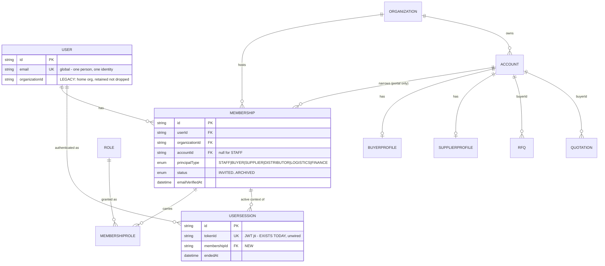
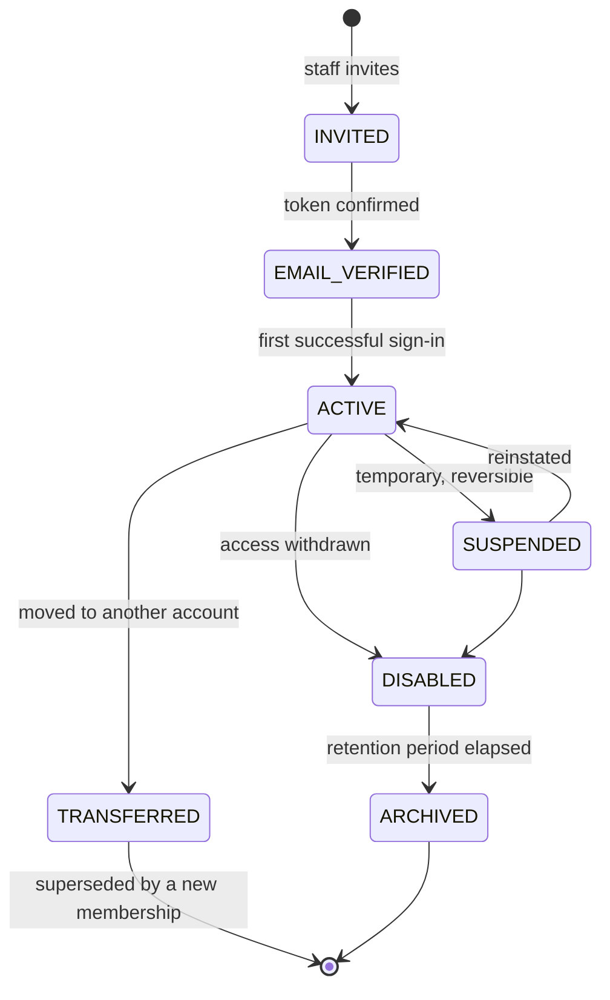
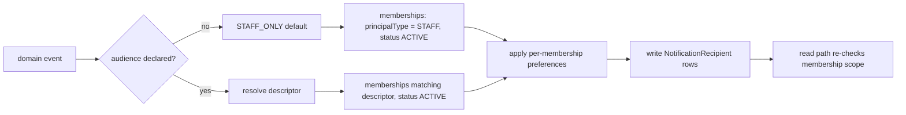

# Identity & Authorization Foundation — V2

**Status:** Design. Supersedes `buyer-identity-architecture.md` (V1, rejected).
**Scope:** Backend only. No portal UI.
**Reference:** TRY-BNP-IDENTITY-02

V1 was rejected. This document treats the review as authoritative and addresses every finding. The name changes deliberately: this is no longer a _buyer_ foundation but an **identity** foundation, because the review established that a design scoped to one portal is the defect.

---

## 0. What changed from V1, and why

| Review finding                                          | V1                 | V2                                                                          |
| ------------------------------------------------------- | ------------------ | --------------------------------------------------------------------------- |
| C1 — "session revocation exists" was **false**          | Claimed inherited  | §6: `jti` wired to the **already-existing** `UserSession` table             |
| C2 — notification fan-out leaks to all org users        | Unaddressed        | §7: audience descriptors, deny-by-default                                   |
| C3 — role ↔ principal type unbound                      | Unaddressed        | §4.4: roles live on the membership; vocabulary gated by `Role.appliesTo`    |
| C4 — `onDelete: Restrict` unreachable under soft delete | Claimed protection | §8.4: lifecycle state, not FK behaviour                                     |
| Structural — `User.accountId` singular                  | Core of design     | §4: **replaced** by `Membership`                                            |
| `User.email @unique` blocks marketplace                 | Called a defect    | §4.2: it is **correct** under a person-centric model — see below            |
| Convention-based `assertStaff`                          | "one guard"        | §5: discriminated-union contexts — **compile-time**, not runtime            |
| Background jobs, exports, reports, search               | Silent             | §5.3                                                                        |
| Buyers inside the export house's organization           | Unexamined         | §4.3: membership grants access _into_ a tenant; tenancy semantics unchanged |

One review criticism I now **reject on evidence**: global `User.email @unique` was called a marketplace blocker. It was only a blocker under V1's "one user, one organization" model. Under §4's person-centric model — one human, one identity, many memberships — global uniqueness is exactly right, and per-org email would be the defect. The review was correct about the symptom and wrong about the cause.

---

## 1. The central decision

V1 asked "how do we attach a buyer to a user?" That question produces `User.accountId` and dies at the second portal.

V2 asks: **"what is the unit of tenancy?"**

The answer is not the user. A person is a global identity. What is tenant-specific is their **membership**: which organization they act in, in what capacity, over which account, with which roles, in which lifecycle state. Everything portal-shaped is a property of that relationship, not of the human.

```
User          — a person. Global. One email, one password, one identity.
Membership    — a person's standing in one organization, optionally narrowed
                to one Account, with a capacity and a lifecycle.
Session       — one issued token, revocable, bound to one active membership.
```

Every portal in the ten-year list is a `PrincipalType` on a membership. No new identity concept is required for supplier, distributor, logistics, finance or marketplace.

---

## 2. Entity diagram



The three edges into `MEMBERSHIP` are the whole design. `USER ↔ ACCOUNT` no longer exists as a direct relation; `Account.ownerId` (internal sales owner) is untouched and remains a separate concern.

---

## 3. Principal types and lifecycle

```
enum PrincipalType { STAFF BUYER SUPPLIER DISTRIBUTOR LOGISTICS FINANCE }
```

Adding a portal is an enum value plus an ability branch. No table, no identity change, no migration to `User`.

### 3.1 Membership lifecycle



| State            | Can authenticate | Can act | Notes                                                     |
| ---------------- | ---------------- | ------- | --------------------------------------------------------- |
| `INVITED`        | No               | No      | Row exists so the invite is auditable and re-sendable     |
| `EMAIL_VERIFIED` | Yes              | No      | Proves the address; still awaiting activation             |
| `ACTIVE`         | Yes              | Yes     | The only state granting authority                         |
| `SUSPENDED`      | No               | No      | Reversible. Sessions revoked on entry                     |
| `DISABLED`       | No               | No      | Terminal for access; retained for audit                   |
| `TRANSFERRED`    | No               | No      | Person moved accounts. Points at the successor membership |
| `ARCHIVED`       | No               | No      | Retention elapsed; PII minimised, audit references intact |

**Lifecycle lives on the membership, not the user.** A person suspended at one exporter must keep working with another — under V1 that was impossible.

`TRANSFERRED` is why this is a state and not a delete: when a buyer contact changes employer, their historical actions must remain attributable to the membership that performed them. Reassigning `accountId` in place would silently rewrite history.

**This supersedes C4.** Access is governed by membership status, not by foreign-key `onDelete`. Soft-deleting an `Account` transitions its memberships to `SUSPENDED` — a state transition the application controls, not an FK rule that soft deletes never trigger.

---

## 4. The membership model

### 4.1 Shape

```
Membership
  id, userId, organizationId
  accountId          nullable — required for portal types, forbidden for STAFF
  principalType
  status
  emailVerifiedAt, invitedById, invitedAt, activatedAt
  transferredToId    nullable — set when status = TRANSFERRED
  createdAt, updatedAt

  UNIQUE (userId, organizationId, accountId)   -- one standing per context
  CHECK  (principalType = 'STAFF' AND accountId IS NULL)
      OR (principalType <> 'STAFF' AND accountId IS NOT NULL)

MembershipRole
  membershipId, roleId
  PRIMARY KEY (membershipId, roleId)
```

The CHECK generalises V1's constraint from "buyer" to "any portal type" and keeps the `RFQ_buyer_matches_type` house precedent.

### 4.2 Why `User.email` stays globally unique

One human, one credential, one lockout record, one password reset path. Their standing in each organization is a membership. Per-organization email would mean N passwords for one person and N independent lockout states — which is both worse security and worse experience, and is precisely what a marketplace must not do.

### 4.3 Tenancy semantics are unchanged

A membership grants a person access **into** an organization's tenant, narrowed to an account. `RFQ.organizationId` still means "the organization that owns this record". A buyer at BuyerCo working with two exporters holds two memberships — one per exporter's tenant — and sees each exporter's records only through the account that represents BuyerCo there.

Nothing about `organizationId` changes, so the 804 existing call sites keep their meaning. This is what makes the design additive despite being a larger idea than V1.

### 4.4 Roles bind to membership — closing C3

Roles move from `UserRole(userId, roleId)` to `MembershipRole(membershipId, roleId)`. Because a membership carries a `principalType`, a role grant now has a capacity to validate against.

`Role` gains `appliesTo PrincipalType[]`. Granting a role whose `appliesTo` excludes the membership's type is rejected. Enforced by a database trigger, not a service rule — the review was right that convention is not enforcement, and a cross-table invariant is the one case where Postgres needs a trigger rather than a CHECK.

The four existing roles get `appliesTo = ['STAFF']` on backfill, which makes the C3 escalation unrepresentable: `ADMIN` cannot be granted to a portal membership at all.

---

## 5. Structural authorization — compile-time, not convention

The review's sharpest criticism: `assertStaff` is a convention that 145 sites must remember. V2 makes the type system carry it.

### 5.1 Contexts are a discriminated union

```
type RequestContext = StaffContext | PortalContext
type ExecutionContext = RequestContext | SystemContext

StaffContext   { kind: 'STAFF';  organizationId, membershipId, ability, user }
PortalContext  { kind: 'PORTAL'; organizationId, membershipId, accountId,
                                 principalType, ability, user }
SystemContext  { kind: 'SYSTEM'; organizationId, reason, jobName }
```

A staff service declares `(ctx: StaffContext, …)`. Passing a `PortalContext` is a **compile error**. Nothing is remembered, nothing is asserted at runtime, and a service written by someone who has never heard of portals is closed to portals by construction.

This inverts V1's guarantee. V1: "forgetting is safe _if_ you called the guard." V2: "you cannot forget, because the signature will not accept the argument."

### 5.2 Repositories cannot be called unscoped

Portal-reachable repository methods take a branded scope that only the resolver can mint:

```
type AccountScope = { readonly __brand: unique symbol; organizationId: string; accountId: string }
```

A service holding only a `PortalContext` can obtain an `AccountScope`; a service holding nothing cannot fabricate one. The repository's `where` is assembled from the scope, never from a DTO — which is also the answer to mass assignment on writes: `buyerId` is taken from the scope and any value in the request body is discarded.

### 5.3 Non-request execution — the gap V1 ignored

| Surface             | Context                     | Rule                                                                               |
| ------------------- | --------------------------- | ---------------------------------------------------------------------------------- |
| Event subscribers   | `SystemContext`             | Explicitly constructed with a `jobName`; audited as a system actor                 |
| Scheduled tasks     | `SystemContext`             | Same                                                                               |
| Exports             | Caller's context, unchanged | An export is a read; it takes the same scope as the list it exports                |
| Reports / analytics | `StaffContext` only         | Raw-SQL aggregates are staff-only until a portal report is designed deliberately   |
| Search              | Caller's context            | Portal search fans out only to portal-enabled sources; §7's audience logic applies |
| Notifications       | Audience policy             | §7                                                                                 |
| Audit writes        | Actor from context          | `SystemContext` writes a system actor, never a borrowed user                       |

`SystemContext` is deliberately **not** a bypass: it carries no ability and cannot be passed to a service expecting a `RequestContext`. A job that needs user-level authority must be given a membership explicitly, which is auditable.

---

## 6. Session architecture — closing C1

### 6.1 The finding

`UserSession.tokenId` is documented in the schema as _"Opaque identifier carried as the JWT `jti`. One row per issued token."_ `sessionRepository` implements `record`, `findByTokenId`, `isActive`, `touch`, `revoke`, `revokeAllForUser`.

**None of it is wired.** The login flow writes no row; no request consults one. The revocation design was specified and abandoned. V2 completes it rather than inventing an alternative.

### 6.2 Options compared

| Option                             | Revocation           | Per-request cost           | Per-device              | Fit                                                            |
| ---------------------------------- | -------------------- | -------------------------- | ----------------------- | -------------------------------------------------------------- |
| **1. JWT + `tokenVersion`**        | Bump counter on User | 1 read (cacheable)         | **No** — all-or-nothing | Rejected: cannot revoke one compromised device                 |
| **2. JWT + `jti` → `UserSession`** | Mark row ended       | 1 indexed read (cacheable) | Yes                     | **Recommended** — schema and repository already exist          |
| **3. Database sessions**           | Delete row           | 1 read, always             | Yes                     | Correct but discards the JWT model and rewrites the auth setup |
| **4. Refresh rotation**            | Invalidate refresh   | **None** on access token   | Yes                     | Best exposure bound; highest client complexity                 |

### 6.3 Recommendation — 2 now, 4 for portals

**Stage A — wire option 2.** `jti` in the token, `record()` on sign-in, `isActive()` on request. Revocation becomes real for staff _and_ portals, and `/v1/auth/sessions` stops being decorative — which also repairs the Sessions tab shipped in #47, currently structurally empty.

**Stage B — option 4 for portal principals.** External users get a short access token (10 minutes) plus a rotating refresh token. Access checks need no database read inside the window; revocation bites within one rotation. Staff keep the 8-hour session unless measurement suggests otherwise.

This is a genuine trade-off, stated plainly: stage A costs one indexed read per request. Mitigations — cache _revocations_ (a small, slow-moving set) rather than validations, and skip the check entirely for tokens under a short TTL in stage B. I would not ship external portals on stage A alone; an 8-hour unrevocable window for an external principal is the exposure C1 identified.

### 6.4 Sessions bind to a membership

`UserSession` gains `membershipId`. A session is authenticated as a _person_ but authorised as a _membership_. Context switching mints a new token bound to the new membership; the old session is ended. Suspending a membership revokes exactly its sessions and leaves the person's other memberships working.

---

## 7. Notification architecture — closing C2

### 7.1 The defect

`generateNotifications` resolves recipients as `listActiveUserIds(organizationId)` — every active user in the tenant, with no principal or subject filter. The moment a portal user exists in that organization they receive every internal event. This is live today and is not gated on this wave.

### 7.2 Notification authorization is its own policy

Request authorization answers _"may this principal read this record if they ask?"_ Notification authorization answers _"should this record be pushed at this principal unasked?"_ They are different questions and V1 conflated them by having no answer at all.

Every event declares an **audience descriptor** at emit time:

```
type Audience =
  | { kind: 'STAFF_ONLY' }                        // default
  | { kind: 'ACCOUNT'; accountId; types[] }       // one counterparty's people
  | { kind: 'ACTORS'; membershipIds[] }           // named participants
  | { kind: 'ROLE'; role }                        // e.g. approvers
```



Three properties:

1. **Deny-by-default.** An event with no declared audience reaches staff only. A new event type written by someone unaware of portals cannot leak.
2. **Audiences are resolved to memberships**, so a suspended or archived membership receives nothing.
3. **Defence in depth.** The read path re-checks that the recipient's membership still matches, so a fan-out bug does not become a permanent disclosure.

Buyers therefore never receive other buyers' events (`ACCOUNT` is exact), supplier events (`STAFF_ONLY` or supplier-account audiences), internal approvals (`ROLE` over staff roles), or staff-only notices.

---

## 8. Threat model

| Threat                              | Control                                                                      | Residual                                                                   |
| ----------------------------------- | ---------------------------------------------------------------------------- | -------------------------------------------------------------------------- |
| Horizontal escalation (buyer→buyer) | Scope from membership; branded `AccountScope`; 404 not 403                   | —                                                                          |
| Vertical escalation (portal→staff)  | `Role.appliesTo` trigger; context union refuses at compile time              | —                                                                          |
| Confused deputy                     | `SystemContext` carries no ability and cannot be passed as a request context | Jobs given explicit memberships must be reviewed                           |
| **Session replay after revocation** | `jti` + `isActive` (stage A); short TTL + rotation (stage B)                 | Stage A: up to cache TTL                                                   |
| Account takeover                    | Existing lockout, rate limit, `LoginAttempt` — inherited unchanged           | —                                                                          |
| Email collision                     | One identity, many memberships — collision is not a case                     | —                                                                          |
| Multi-tenant leakage                | `organizationId` semantics unchanged; membership narrows, never widens       | —                                                                          |
| Cross-account access                | `UNIQUE(userId, organizationId, accountId)`; scope never from a DTO          | —                                                                          |
| Soft-delete bypass                  | Lifecycle state governs access, not FK behaviour                             | Account soft-delete must transition memberships — an application invariant |
| **Notification leakage**            | Audience descriptors, deny-by-default, read-path recheck                     | —                                                                          |
| Search leakage                      | Portal search restricted to portal-enabled sources                           | Sources must be enumerated per portal                                      |
| Audit bypass                        | Audit actor derived from context; `SystemContext` writes a system actor      | —                                                                          |
| Mass assignment                     | `buyerId`/`accountId` always from scope; body values discarded               | —                                                                          |
| TOCTOU on membership status         | Status checked at token mint and at `isActive`; stage B bounds to 10 min     | Stage A: bounded by cache TTL                                              |
| Race: concurrent context switch     | Session bound to one membership; switching ends the prior session            | —                                                                          |
| ID enumeration / timing             | 404 for out-of-scope, matching existing cross-tenant rule                    | —                                                                          |
| JWT forgery                         | Unchanged `AUTH_SECRET`; `jti` adds no new assumption                        | Secret rotation still undesigned                                           |

**Stated honestly:** the weakest remaining link is stage A's cache window and the application invariant that soft-deleting an account must suspend its memberships. Both are narrow, both are testable, and neither is a structural flaw of the model.

---

## 9. Migration strategy

Additive only. Nothing renamed, nothing dropped, no semantics changed.

| #   | Migration                                                                                                         | Risk                                                                      |
| --- | ----------------------------------------------------------------------------------------------------------------- | ------------------------------------------------------------------------- |
| 1   | `PrincipalType`, `MembershipStatus` enums                                                                         | None                                                                      |
| 2   | `Membership`, `MembershipRole` tables; unique + CHECK                                                             | None — new tables                                                         |
| 3   | `Role.appliesTo PrincipalType[] DEFAULT ARRAY['STAFF']`                                                           | None — default matches reality                                            |
| 4   | Backfill: one `STAFF` membership per existing user from `User.organizationId`; copy `UserRole` → `MembershipRole` | Data migration — idempotent, re-runnable, verified by row-count assertion |
| 5   | `UserSession.membershipId` nullable                                                                               | None                                                                      |
| 6   | Role-vocabulary trigger                                                                                           | None — satisfied by backfilled data                                       |

**`User.organizationId` and `UserRole` are retained, not dropped.** They become legacy read paths behind a dual-read: `resolveContext` prefers a membership and falls back to the legacy columns. Once every session carries a `membershipId`, the fallback is dead code — but the columns stay, per the never-delete rule.

**Backfill is the only data migration**, and it is deterministic: every existing user is staff in exactly one organization with a known role set.

---

## 10. Backward compatibility

| Surface                                                     | Effect                                                                   |
| ----------------------------------------------------------- | ------------------------------------------------------------------------ |
| JWTs in flight (no `membershipId`, no `jti`)                | Fall back to legacy resolution → identical behaviour, no forced re-login |
| 145 `assertAbility` sites                                   | Unchanged; `StaffContext` satisfies them exactly as today                |
| 804 repository `organizationId` args                        | Unchanged                                                                |
| `buildAbilityFor` for the four roles                        | Untouched                                                                |
| Admin portal, supplier workflows, RFQ/quotation staff flows | Unaffected                                                               |
| `/v1/auth/sessions`                                         | Starts returning real rows — a **bug fix**, not a break                  |
| `/admin/users/:id/roles` (merged #46)                       | Continues; gains a membership dimension in a later stage                 |
| Permission matrix                                           | Gains portal roles automatically — it derives from `ROLES`/`SUBJECTS`    |

The compatibility strategy is the same idea that worked in V1 and is worth keeping: **absent claim means legacy**, and legacy means today's behaviour.

---

## 11. Rollout plan

| Stage | Content                                                               | Gate                                                                                              |
| ----- | --------------------------------------------------------------------- | ------------------------------------------------------------------------------------------------- |
| **0** | Fix notification fan-out (audience descriptors, `STAFF_ONLY` default) | Independent of identity. Fixes a live leak. Ship first                                            |
| **1** | Wire `jti` → `UserSession`; per-request `isActive`                    | Revocation demonstrably works for staff; `/v1/auth/sessions` and the #47 Sessions tab become real |
| **2** | Membership tables, backfill, dual-read resolution                     | Full suite green with **zero behaviour change**                                                   |
| **3** | Context discriminated union; staff services retyped `StaffContext`    | Compiles only if every staff service is correctly typed — the compiler is the test                |
| **4** | `PrincipalType` branches, `AccountScope`, portal-scoped repositories  | Integration tests: portal principal sees own rows, 404 for others                                 |
| **5** | Membership administration (invite, suspend, transfer)                 | Staff-only, audited                                                                               |
| **6** | Refresh rotation for portal principals                                | Exposure window ≤ 10 min                                                                          |
| **7** | First portal opts in, one module at a time                            | Per-module integration tests                                                                      |

**Stages 0 and 1 are worth shipping regardless of whether portals proceed.** One fixes a live leak; the other repairs a security control that is currently decorative. That property — value independent of the speculative work — is what V1 lacked.

**Stage 3 is the keystone.** It ships no feature and grants nothing; it changes types until the compiler proves every staff service refuses portal contexts. If it compiles and the suite is green, the safety property is established before any portal principal exists.

---

## 12. Ten-year extensibility

| Future                                                              | Fit                                                                | New concept? |
| ------------------------------------------------------------------- | ------------------------------------------------------------------ | ------------ |
| Supplier / Distributor / Logistics / Finance portals                | `PrincipalType` value + ability branch                             | No           |
| Orders, Shipments, Invoices, Payments, Returns, Warehouse, Tracking | `accountId` scope applies unchanged                                | No           |
| Support tickets                                                     | `ACTORS` audience; membership-scoped                               | No           |
| Marketplace: one person, many organizations                         | Many memberships; context switch                                   | No           |
| A company that both buys and sells                                  | Two memberships, two principal types, one login                    | No           |
| Service provider spanning many accounts                             | Many memberships in one organization                               | No           |
| Public API / machine principals                                     | A fourth context variant (`ServiceContext`) beside `SystemContext` | Additive     |
| Delegated access ("act on behalf of")                               | Membership with a `delegatedFromId`                                | Additive     |

The test the review demanded: **no item above requires changing `User`, `Membership`'s shape, or the JWT contract.** Each is an enum value, an ability branch, or a new context variant.

---

## 13. Risks

1. **Stage 3 is a large mechanical change** across every staff service signature. Low semantic risk, high diff volume; the compiler verifies it, but review fatigue is real. Mitigation: one package per PR.
2. **Per-request session read** (stage 1) adds latency to every authenticated request. Must be measured before stage 7, not assumed.
3. **Dual-read window** (stage 2) means two resolution paths coexist. Mitigation: a metric counting legacy-path resolutions; stage 4 begins only when it reaches zero.
4. **Trigger-based role validation** is the one piece of logic in the database rather than TypeScript. Justified — a cross-table invariant cannot be a CHECK — but it must be tested like code.
5. **Backfill correctness** is load-bearing: a user who ends up with no membership loses access. Mitigation: assert `COUNT(memberships) = COUNT(users)` in the migration itself.

---

## 14. Open questions

1. **Portal access token TTL** — 10 minutes (recommended) or 30? Trades revocation latency against refresh traffic.
2. **Context switching UX** — implicit (last used) or explicit (a chooser at sign-in)? Affects whether the token can be minted before a membership is selected.
3. **Multiple memberships in one organization** — should a person be both STAFF and BUYER at the same exporter? The unique key permits it. Recommend forbidding it by service rule; it is a confused-deputy risk.
4. **Archive retention period** and what "PII minimised" means concretely — a legal question, not an engineering one.
5. **Can a portal membership be invited by another portal user**, or staff only? Staff-only is the safe default; marketplace self-service will eventually want otherwise.
6. **`AUTH_SECRET` rotation** — undesigned in V1 and V2. Worth its own note before external principals exist.

Question 3 has the largest security surface: dual capacity in one tenant is exactly the shape of a confused-deputy bug.

---

## 15. Constraints honoured

- Design only. No implementation, no migrations generated, no code.
- Additive only: no rename, no drop, no changed semantics. `User.organizationId` and `UserRole` retained.
- Staff behaviour unchanged; the four existing roles untouched and pinned to `STAFF`.
- Every V1 rejection addressed, with one criticism rebutted on evidence (§0).
- No endpoint invented; portal capability is staged behind gates.
