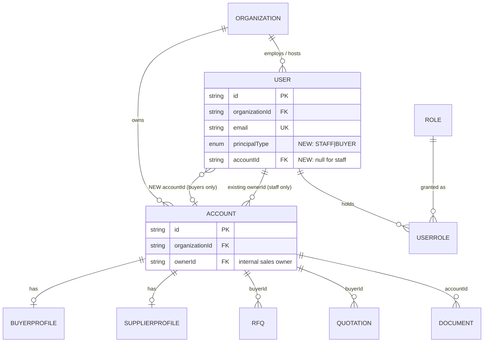
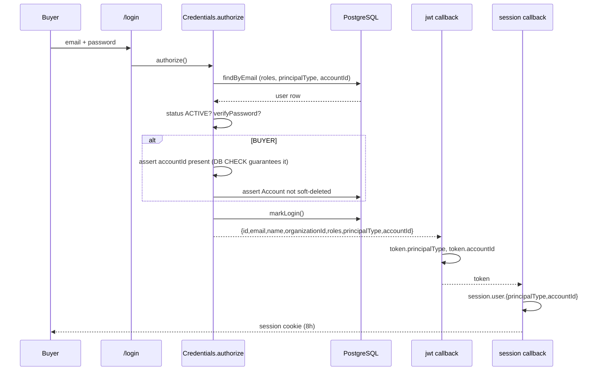
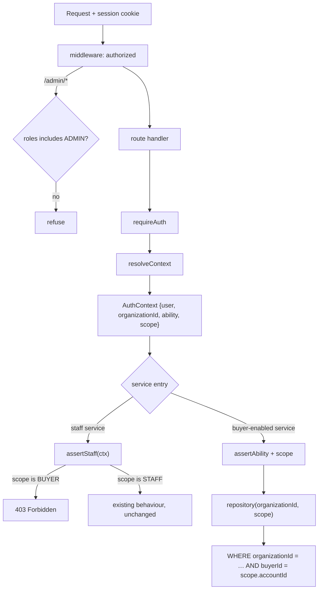
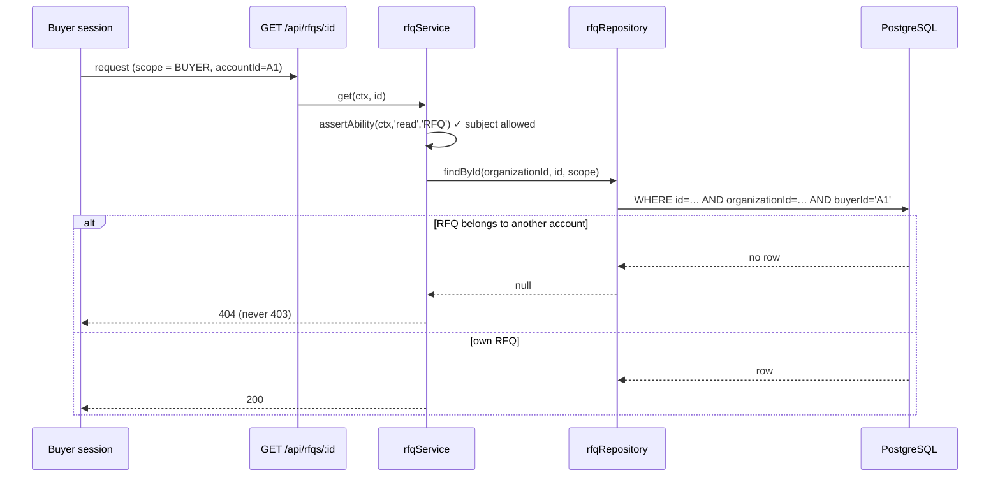

# Buyer Identity & Authorization Foundation

**Status:** Design. Not implemented. No migrations generated.
**Scope:** Backend only. No Buyer Portal UI, no preview screens.
**Reference:** TRY-BNP-BUYER-01

---

## 0. What this design is built on (verified, not assumed)

Every claim below was read from the repository at `a69a732`, not recalled.

| Fact                                      | Evidence                                                                                        |
| ----------------------------------------- | ----------------------------------------------------------------------------------------------- |
| Four roles exist                          | `RoleName` enum, `ROLES`, `ASSIGNABLE_ROLES` — all `ADMIN, EXPORT_MANAGER, VERIFIER, READ_ONLY` |
| No Order module                           | `grep -c "^model Order" schema.prisma` → `0`                                                    |
| Org isolation is pervasive                | 804 `organizationId` occurrences across 42 repositories                                         |
| Ability checks are subject-level          | 145 `assertAbility(` call sites in `packages/core`                                              |
| A user's only account link is _ownership_ | `Account.ownerId → User @relation("AccountOwner")`                                              |

---

## 1. Current architecture audit

### 1.1 User model

```prisma
model User {
  id, organizationId, email @unique, name, passwordHash
  status UserStatus @default(ACTIVE)
  lastLoginAt, avatarUrl, preferences, createdAt, updatedAt
  organization  Organization @relation(...)
  roles         UserRole[]
  ownedAccounts Account[] @relation("AccountOwner")
  securityProfile, emailVerificationTokens, sessions, scopedRoles
  @@index([organizationId])
}
```

A `User` is scoped to exactly one `Organization` — the tenant, i.e. the export house. There is **no** field or relation placing a user inside an `Account`. `ownedAccounts` points the opposite way: it is the internal sales owner of a customer account.

### 1.2 Account model

```prisma
model Account {
  id, organizationId, legalName, displayName, country
  relationshipStatus RelationshipStatus @default(PROSPECT)
  ownerId String?           // internal sales owner
  createdById, updatedById, deletedById, version, timestamps
  owner           User?            @relation("AccountOwner", ...)
  supplierProfile SupplierProfile?
  buyerProfile    BuyerProfile?
  rfqs            RFQ[]
  quotations      Quotation[]
}
```

An `Account` is a **trading counterparty record**, maintained by staff. It already owns the two collections a buyer would want to see — `rfqs` and `quotations` — which is what makes this design tractable.

### 1.3 BuyerProfile model

```prisma
model BuyerProfile {
  id, accountId @unique, organizationId
  businessType, annualRequirement, annualBudgetBand, importExperience
  destinationCountries[], destinationPort, incoterms[], paymentTerms[]
  certificationsRequired[], languages[]
  website, socialLinks, description
  version, audit columns
  account  Account @relation(...)
  products BuyerProduct[]
}
```

Commercial preferences describing a counterparty. It carries **no credentials, no login identity, no user link**. It describes a company, not a person.

### 1.4 CASL model

```ts
if (has('ADMIN'))          can('manage', 'all')
if (has('EXPORT_MANAGER')) can('read', 'all'); can(['create','update'], [8 subjects])
if (has('VERIFIER'))       can('read', 'all'); can(['verify','update'], 'Verification'); …
if (has('READ_ONLY'))      can('read', 'all')
```

Three properties matter for this design:

1. **Every non-ADMIN role holds `read all`.** There is no row-level condition anywhere.
2. **Subjects are string tokens**, and `RFQ`/`Quotation` are _not_ among them — those modules gate on the `Account` subject.
3. **Checks are subject-level**: `assertAbility(ctx, 'read', 'Account')` asks "may this principal read _some_ Account?" It cannot ask "_this_ Account".

Property 3 is the single most important constraint on this design, and §4.2 addresses it directly.

### 1.5 JWT / session model

```
POST /login → Credentials.authorize()
  → userRepository.findByEmail  → status must be ACTIVE
  → verifyPassword(bcrypt)      → markLogin()
  → returns { id, email, name, organizationId, roles }

jwt({token,user})     → token.organizationId, token.roles
session({session,token}) → session.user.{id,organizationId,roles}   [edge config]
resolveContext(session)  → { user, organizationId, ability: buildAbilityFor(user.roles) }
```

Strategy is JWT, `maxAge` 8 hours. The token carries exactly two custom claims: `organizationId` and `roles`. `AuthContext` is derived from those and nothing else.

### 1.6 Organization isolation

Isolation is **query-level, not policy-level**. `ctx.organizationId` comes from the session and is passed as an argument into every repository call:

```ts
prisma.rFQ.findMany({ where: { organizationId, … } })
```

804 occurrences across 42 repositories. Crucially, `organizationId` is **never a request parameter** — it cannot be widened by a caller. This is the pattern the buyer scope must imitate, because it is the pattern that has held.

---

## 2. Why external buyers cannot exist today

Four independent blockers. Any one of them alone is fatal.

1. **No identity.** No `BUYER` role, and no relation from `User` to the `Account` they represent. A session cannot answer "which buyer is this?"
2. **No scoping mechanism.** `AuthContext` carries `organizationId` only. Even if a buyer authenticated, nothing in the context could narrow a query to their account.
3. **`read all` on every role.** Assigning a buyer any existing role grants read access to every RFQ, quotation, supplier and audit row in the tenant.
4. **Subject-level checks cannot express row rules.** Adding CASL conditions alone would not help: `ability.can('read','Account')` returns `true` when _any_ conditional rule matches, so a conditional grant still passes every existing `assertAbility` call unchanged.

Blocker 4 is why "just add conditions to CASL" is not a design. It would produce a system that _appears_ to enforce buyer scoping while every existing endpoint continued to serve everything.

---

## 3. Design principles

1. **Extend, never replace.** Staff behaviour must be byte-identical.
2. **Deny by default.** A buyer principal is refused everywhere until an endpoint explicitly opts in. Safety must not depend on auditing 145 call sites.
3. **Scope like the tenant.** Buyer scope is threaded into queries the way `organizationId` already is — never derived from a request parameter.
4. **Invariants in the database.** Where the schema can guarantee something, it should.
5. **Absent claim = staff.** Old tokens must keep working with unchanged meaning.

---

## 4. The design

### 4.1 Identity — two additive columns

```prisma
model User {
  // … all existing fields unchanged …
  principalType PrincipalType @default(STAFF)   // NEW
  accountId     String?                          // NEW, null for staff
  account       Account? @relation("AccountMember", fields: [accountId], references: [id], onDelete: Restrict)
  @@index([accountId])                           // NEW
}

enum PrincipalType { STAFF BUYER }               // NEW
```

Plus a CHECK constraint making the invariant a database guarantee:

```sql
ALTER TABLE "User" ADD CONSTRAINT "User_principal_matches_account"
CHECK (
  ("principalType" = 'STAFF' AND "accountId" IS NULL) OR
  ("principalType" = 'BUYER' AND "accountId" IS NOT NULL)
);
```

**This mirrors an existing precedent.** The schema already uses exactly this shape in `RFQ_buyer_matches_type` — a type discriminator paired with a CHECK that the corresponding FK is present or absent. The house style is followed, not invented.

Why a discriminator rather than inferring "buyer" from the role: a role is a grant and can be revoked, added, or held alongside others. Principal type is what the account _is_. Deriving identity from a mutable grant means a mis-click on the roles screen could turn a buyer into staff. The database refuses that.

`onDelete: Restrict` — deleting an Account with live buyer users must fail loudly rather than orphan or cascade-delete logins.

### 4.2 Authorization — a scope, not just a rule

Two layers, because CASL alone cannot do this (§2, blocker 4).

**Layer 1 — CASL gains a buyer branch.** Additive; existing branches untouched.

```ts
if (has('BUYER')) {
  can('read', ['RFQ', 'Quotation', 'Document', 'Activity'])
  can('create', 'RFQ')
  can('update', 'RFQ') // own drafts; instance rules in layer 2
  // deliberately absent: SupplierProfile, Account, User,
  // Organization, Verification, ReferenceData
}
```

`RFQ` and `Quotation` become new `SUBJECTS` members — additive to the array that `@triyara/auth` already exports, and therefore automatically present in the permission matrix endpoint with no second copy.

**Layer 2 — `AccessScope` on `AuthContext`.** This is what actually enforces row-level access.

```ts
interface AuthContext {
  readonly user: AuthUser
  readonly organizationId: string
  readonly ability: AppAbility
  readonly scope: AccessScope // NEW
}

type AccessScope = { kind: 'STAFF' } | { kind: 'BUYER'; accountId: string }
```

Repositories that serve buyer-reachable data take the scope alongside `organizationId` and translate it into a `where` clause — exactly as `organizationId` is handled today:

```ts
// illustrative, not final
function buyerWhere(scope: AccessScope) {
  return scope.kind === 'BUYER' ? { buyerId: scope.accountId } : {}
}
```

Because the scope is derived from the JWT and never from a query parameter, a buyer cannot widen it — the same property that has kept `organizationId` safe across 804 call sites.

### 4.3 Deny by default — the gateway

The critical safety control. Rather than auditing 145 `assertAbility` sites to confirm each refuses buyers, **one guard refuses buyers everywhere by default**:

```ts
// Every existing staff service entry point begins with this.
assertStaff(ctx) // throws ForbiddenError when ctx.scope.kind === 'BUYER'
```

Introduced once and applied at the staff-service boundary. New buyer-facing endpoints are the explicit exception, each opting in and each taking the scope. The consequence: **an endpoint written before this wave, or written after it without thinking about buyers, refuses buyers.** Forgetting is safe; that is the property worth paying for.

---

## 5. Entity diagram



The two `USER ↔ ACCOUNT` edges are deliberately distinct relations: `AccountOwner` (a staff member owns a customer) and `AccountMember` (a buyer user belongs to a customer). Conflating them would let a sales owner be treated as a buyer.

---

## 6. Authentication flow



One provider, one credential store, one password policy. Buyers are not a second auth system — they are a second **principal type** on the existing one. That is what keeps lockout, rate limiting, session revocation and the login-attempt audit working for them from day one.

---

## 7. Request flow



The middleware change is one added clause: buyers are refused on `/admin/*` and every staff route prefix. Staff paths through this diagram are byte-identical to today.

---

## 8. Authorization sequence — a buyer reading an RFQ



**404, never 403** — consistent with the existing cross-tenant rule. Answering 403 would confirm that an RFQ with that id exists, which is itself a disclosure.

---

## 9. Migration plan

Four migrations, each independently deployable and reversible. No renames, no drops, no semantic changes.

| #   | Migration             | Content                                                                                | Risk                                                                                                                |
| --- | --------------------- | -------------------------------------------------------------------------------------- | ------------------------------------------------------------------------------------------------------------------- |
| 1   | `add_principal_type`  | `CREATE TYPE "PrincipalType"`; `ADD COLUMN "principalType" … DEFAULT 'STAFF' NOT NULL` | None — every existing row becomes `STAFF`, which is what they are                                                   |
| 2   | `add_user_account`    | `ADD COLUMN "accountId" TEXT NULL`; FK `ON DELETE RESTRICT`; `CREATE INDEX`            | None — nullable, no backfill                                                                                        |
| 3   | `add_principal_check` | `ADD CONSTRAINT "User_principal_matches_account" CHECK (…)`                            | None — satisfied by all existing rows                                                                               |
| 4   | `add_buyer_role`      | `ALTER TYPE "RoleName" ADD VALUE 'BUYER'`                                              | Must be its **own** migration and not run inside a transaction with usage — Postgres restriction on new enum values |

Migration 4's constraint is a real Postgres behaviour, not a preference: a value added to an enum cannot be used in the same transaction that adds it. Keeping it isolated avoids a deploy-time failure that would only appear on a fresh replay.

**Backfill: none.** Every existing user is staff, and `DEFAULT 'STAFF'` states that without touching a row.

**Drift and seed:** the seed gains no buyer user by default; buyer creation is an administrative action. Seed idempotency is unaffected because no seeded row changes.

---

## 10. Backward compatibility

| Surface                                                     | Effect                                                                                                                               |
| ----------------------------------------------------------- | ------------------------------------------------------------------------------------------------------------------------------------ |
| Existing JWTs in flight                                     | No `principalType` claim → read as `STAFF`, `accountId` null. Identical behaviour, no forced re-login.                               |
| `AuthUser` / `AuthContext`                                  | New fields added; existing fields unchanged. `scope` defaults to `{kind:'STAFF'}`.                                                   |
| 145 `assertAbility` call sites                              | Unchanged. Staff pass exactly as before.                                                                                             |
| 804 repository `organizationId` args                        | Unchanged. Scope is an _additional_ argument on buyer-reachable methods only.                                                        |
| `buildAbilityFor` for the four existing roles               | Untouched.                                                                                                                           |
| Admin portal, supplier workflows, RFQ/quotation staff flows | Unaffected — no staff code path reads the new fields.                                                                                |
| Permission matrix endpoint                                  | Automatically gains the `BUYER` row and the new subjects, because it derives from `ROLES` and `SUBJECTS` rather than restating them. |

The compatibility story rests on one property: **absent claim means staff.** Nothing needs migrating because the default is the status quo.

---

## 11. Threat model

| Threat                                             | Control                                                                                                 |
| -------------------------------------------------- | ------------------------------------------------------------------------------------------------------- |
| Buyer reads another buyer's RFQ                    | Scope from JWT, applied in the `WHERE`; never a request parameter                                       |
| Buyer escalates by passing `?buyerId=`             | Parameter is ignored for BUYER principals; scope always overrides                                       |
| Buyer reads supplier master (cost/margin exposure) | `SupplierProfile` absent from the buyer ability; `assertStaff` on supplier services                     |
| Buyer reads the audit trail                        | Audit requires `manage Organization`; buyers hold nothing on `Organization`                             |
| Buyer reads staff directory                        | `/v1/users` and `/v1/admin/users` are staff services behind `assertStaff`                               |
| Buyer granted a staff role by mistake              | CHECK constraint: a BUYER row must keep its `accountId`; role screens must refuse mixing (service rule) |
| New endpoint forgets buyer scoping                 | **Deny by default** — an endpoint that does not opt in refuses buyers                                   |
| Account deleted while buyer logged in              | `onDelete: Restrict` plus a login-time and request-time account-status check                            |
| Buyer enumerates ids via 403/404 difference        | 404 for anything outside scope, matching the existing cross-tenant rule                                 |
| Credential stuffing against buyer logins           | Inherits the existing per-email rate limiter, lockout policy and `LoginAttempt` audit                   |

**Residual risk, stated plainly:** the deny-by-default gateway is only as good as its placement. If a future service is written that neither calls `assertStaff` nor takes a scope, it would be reachable by buyers. The mitigation is a test that enumerates service entry points and asserts each one either refuses a BUYER context or accepts a scope — a lint-by-test, in the style of the existing OpenAPI-drift test.

---

## 12. Performance

- **`@@index([accountId])` on User** — buyer login resolves by email (already unique-indexed); the account index serves "list users of this account".
- **Buyer-scoped list queries need no new indexes.** This was checked rather than assumed, and the result is better than expected — every buyer-reachable table is already indexed for exactly this access pattern:

  | Table       | Existing index                                   |
  | ----------- | ------------------------------------------------ |
  | `RFQ`       | `[organizationId, buyerId, status]`, `[buyerId]` |
  | `Quotation` | `[organizationId, buyerId, status]`, `[buyerId]` |
  | `Document`  | `[organizationId, accountId, deletedAt]`         |

  Adding `buyerId` to a `WHERE` that already filters `organizationId` therefore lands on a composite index that exists today. **No index migration is required for stage 3.**

- **No extra round trip per request.** `accountId` rides in the JWT; resolving scope requires no database read.
- **JWT size** grows by roughly 40 bytes — negligible against the 4 KB cookie limit.
- **Account status check on each request** is the one cost worth debating: verifying the account is still active per request costs a read. Recommendation is to check at **login** and rely on session expiry (8h) plus explicit session revocation for the rest, which is the trade-off the platform already makes for user status.

---

## 13. Security considerations

1. **Password policy, lockout and login audit are inherited, not duplicated.** Buyers use the same Credentials provider, so `UserSecurityProfile`, `LoginAttempt` and the rate limiter cover them from day one.
2. **Email uniqueness is global.** A person who is both a staff member and a buyer contact would need two identities. That is correct — they are two principals with different powers — but it must be a stated product rule, not a surprise.
3. **Session revocation already exists** (`/v1/auth/sessions/:id`) and applies to buyers unchanged.
4. **The permission matrix becomes buyer-visible.** It carries no tenant data, so this is acceptable; it will simply show a `BUYER` row.
5. **Soft-deleted accounts** must refuse login. `Account.deletedAt` is checked in `authorize()`.

---

## 14. Future extensibility

The design is shaped so that later modules need no rework:

| Future module                       | How it fits                                                                                                                                      |
| ----------------------------------- | ------------------------------------------------------------------------------------------------------------------------------------------------ |
| Orders                              | `Order.buyerId → Account`. Buyer ability gains `read Order`; the same `buyerWhere(scope)` applies. No identity change.                           |
| Shipments                           | Hangs off Order; scope inherited transitively.                                                                                                   |
| Payments                            | Same. Cost/margin fields stay staff-only via projection, exactly as supplier cost is redacted today.                                             |
| Multiple users per buyer company    | Already supported — `accountId` is many-to-one.                                                                                                  |
| A buyer contact with limited rights | A second role (e.g. `BUYER_VIEWER`) in the same branch; scope is orthogonal to role.                                                             |
| Supplier portal                     | The same `PrincipalType` gains `SUPPLIER`, scoping to `Account.supplierProfile`. **This is why the discriminator is an enum and not a boolean.** |

That last row is the main reason for `PrincipalType` rather than `isBuyer`. A supplier portal is a plausible next ask, and a boolean would have to be redesigned.

---

## 15. Rollout strategy

| Stage | Content                                                                                           | Gate                                                                                   |
| ----- | ------------------------------------------------------------------------------------------------- | -------------------------------------------------------------------------------------- |
| 1     | Migrations 1–4, `PrincipalType`, `User.accountId`, CHECK, `BUYER` enum value                      | Replay from empty · drift · seed idempotency · all existing tests green                |
| 2     | `AccessScope` on `AuthContext`, JWT claims, `assertStaff` applied at every staff service boundary | Full suite green with **zero behaviour change** — this stage ships no buyer capability |
| 3     | Buyer CASL branch, new `RFQ`/`Quotation` subjects, scoped repository methods                      | Integration tests proving a buyer sees only their own rows, and 404 for others'        |
| 4     | Buyer user administration (staff creates/invites buyer users)                                     | Admin-only endpoints, audited                                                          |
| 5     | Buyer-facing read endpoints opt in one module at a time                                           | Per-module integration tests                                                           |

**Stage 2 is deliberately inert.** It introduces the guard everywhere and grants nothing. If the full suite passes with no behavioural change, the safety net is proven before a single buyer can log in. That ordering is what makes this wave reversible: stages 1–2 can ship and sit dormant indefinitely.

**Feature flag:** buyer login should be refused at the provider until stage 5, so the identity can exist in production before the portal does.

---

## 16. Open questions for decision

1. **Buyer user creation** — staff-invites-only (recommended), or self-registration with an approval queue?
2. **Email collision** — if a buyer contact already exists as a staff user, refuse (recommended) or allow two identities with distinct emails?
3. **Per-request account status check** — accept the 8-hour session lag (recommended, matches user status today), or pay a read per request?
4. **Buyer RFQ creation** — may a buyer raise an RFQ directly, or only view ones staff raised on their behalf? This changes whether `create RFQ` is in the buyer ability at all.
   Question 4 has the largest blast radius: it determines whether buyers are read-only consumers or participants, and therefore how much of the RFQ state machine must become buyer-aware.

_(A fifth question — whether composite indexes were needed — was resolved during the audit: they already exist. See §12.)_

---

## 17. Constraints honoured

- No implementation, no migrations generated, no code.
- Additive only: no rename, no drop, no changed semantics.
- Staff behaviour unchanged; the four existing roles are untouched.
- Existing APIs, admin portal and supplier workflows unaffected.
- No endpoint invented — every buyer-facing capability is listed as future work behind a stage gate.
