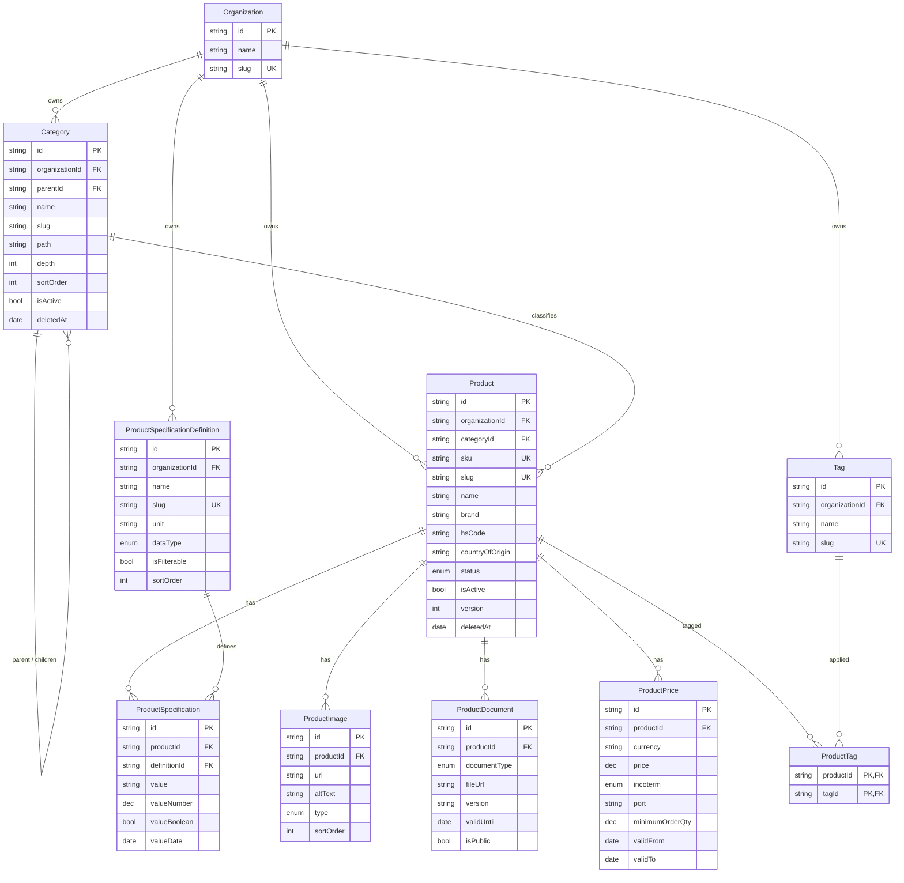

# Product Catalog — Sprint 1 Domain Model

Enterprise master-data model for the Triyara Business Network Platform product catalog.
Design deliverable only: **no API, no frontend, no migration** is produced here.

Stack: Next.js · Prisma · PostgreSQL (Neon) · TypeScript.

---

## 0. Relationship to the Phase 17 catalog (read this first)

A product catalog already exists on the unmerged branch `feature/product-catalog`
(commit `537a00d`, awaiting review). The Sprint 1 model below is a **rename plus
superset** of it, not a competing design. Mapping:

| Sprint 1 model                   | Phase 17 equivalent                                         | Delta                                                   |
| -------------------------------- | ----------------------------------------------------------- | ------------------------------------------------------- |
| `Category`                       | `ProductCategory`                                           | rename; adds `path`, `depth`                            |
| `Product`                        | `Product`                                                   | adds `brand`; `hsCode`/`countryOfOrigin` become scalars |
| `ProductSpecificationDefinition` | `ProductAttribute`                                          | rename; adds `allowedValues`, `isFilterable`            |
| `ProductSpecification`           | `ProductAttributeValue`                                     | rename; adds typed projection columns                   |
| `ProductImage`                   | —                                                           | **new**                                                 |
| `ProductDocument`                | —                                                           | **new**                                                 |
| `ProductPrice`                   | —                                                           | **new**                                                 |
| `Tag` / `ProductTag`             | —                                                           | **new**                                                 |
| —                                | `HSCode`, `UnitOfMeasure`, `PackagingType`, `OriginCountry` | reference lookups, retained (see §4.8)                  |
| —                                | `ProductLink`                                               | supplier/buyer extension seam, retained                 |

**Open decision for the reviewer:** adopt the Sprint 1 names as canonical (Phase 17
becomes the migration source), or keep the Phase 17 names and treat this document as the
extension spec. The model is identical either way; only identifiers change.

---

## 1. Complete Prisma schema

```prisma
// ==========================================================================
// ENUMS
// ==========================================================================

/// Editorial + commercial lifecycle of a catalog product.
/// DRAFT -> PENDING_REVIEW -> ACTIVE -> DISCONTINUED -> ARCHIVED
enum ProductStatus {
  DRAFT
  PENDING_REVIEW
  ACTIVE
  DISCONTINUED
  ARCHIVED
}

/// Storage type of a specification value. Drives validation and which typed
/// projection column on ProductSpecification is populated.
enum DataType {
  STRING
  NUMBER
  BOOLEAN
  DATE
  ENUM
}

/// Role an image plays in the product's media set.
enum ImageType {
  PRIMARY
  GALLERY
  THUMBNAIL
  PACKAGING
  LABEL
}

/// PRODUCT-level document classes. Named ProductDocumentType because the
/// frozen Documents module already owns a COMPANY-level `DocumentType`
/// (GST, IEC, APEDA, HACCP, ...). See §4.11.
enum ProductDocumentType {
  COA
  MSDS
  SPEC_SHEET
  ISO_CERTIFICATE
  FSSAI
  HALAL
  KOSHER
  LAB_REPORT
  ORGANIC_CERTIFICATE
  PHYTOSANITARY
  CERTIFICATE_OF_ORIGIN
  OTHER
}

/// Incoterms 2020 — all eleven rules.
enum Incoterm {
  EXW
  FCA
  FAS
  FOB
  CFR
  CIF
  CPT
  CIP
  DAP
  DPU
  DDP
}

// ==========================================================================
// CATEGORY — unlimited nesting (adjacency list + materialised path)
// ==========================================================================

model Category {
  id             String @id @default(cuid())
  organizationId String

  parentId    String?
  name        String
  slug        String
  description String?

  /// Denormalised ancestry, maintained by the service on create/move.
  /// Example: "/spices/whole-spices/turmeric". Enables O(1) subtree reads
  /// via `path LIKE '/spices/%'` instead of a recursive CTE.
  path  String
  /// Root = 0. Denormalised depth for breadcrumb + max-depth guards.
  depth Int    @default(0)

  sortOrder Int     @default(0)
  isActive  Boolean @default(true)

  version   Int       @default(1)
  createdAt DateTime  @default(now())
  updatedAt DateTime  @updatedAt
  deletedAt DateTime?

  organization Organization @relation(fields: [organizationId], references: [id], onDelete: Cascade)
  parent       Category?    @relation("CategoryTree", fields: [parentId], references: [id], onDelete: Restrict)
  children     Category[]   @relation("CategoryTree")
  products     Product[]

  @@unique([organizationId, slug])
  @@index([organizationId, parentId, sortOrder])
  @@index([organizationId, path])
  @@index([organizationId, isActive, deletedAt])
}

// ==========================================================================
// PRODUCT — the master record every other module references
// ==========================================================================

model Product {
  id             String @id @default(cuid())
  organizationId String

  sku              String
  name             String
  slug             String
  shortDescription String?
  description      String? @db.Text

  categoryId String

  /// ISO 3166-1 alpha-2 (e.g. "IN"). Scalar by design — see §4.8.
  countryOfOrigin String? @db.Char(2)
  brand           String?
  /// HS / HSN tariff code, 6-12 digits, stored unformatted.
  hsCode          String?

  status   ProductStatus @default(DRAFT)
  isActive Boolean       @default(true)

  version   Int       @default(1)
  createdAt DateTime  @default(now())
  updatedAt DateTime  @updatedAt
  deletedAt DateTime?

  organization Organization @relation(fields: [organizationId], references: [id], onDelete: Cascade)
  category     Category     @relation(fields: [categoryId], references: [id], onDelete: Restrict)

  specifications ProductSpecification[]
  images         ProductImage[]
  documents      ProductDocument[]
  prices         ProductPrice[]
  tags           ProductTag[]

  @@unique([organizationId, sku])
  @@unique([organizationId, slug])
  @@index([organizationId, categoryId, status])
  @@index([organizationId, status, isActive, deletedAt])
  @@index([organizationId, hsCode])
  @@index([organizationId, countryOfOrigin])
  @@index([organizationId, brand])
  @@index([categoryId])
}

// ==========================================================================
// SPECIFICATIONS — definition + value (EAV)
// ==========================================================================

model ProductSpecificationDefinition {
  id             String @id @default(cuid())
  organizationId String

  name     String
  slug     String
  /// Unit of measure for the value, e.g. "%", "mesh", "months", "kg".
  unit     String?
  dataType DataType @default(STRING)

  /// Permitted values when dataType = ENUM (e.g. Grade: A, B, C).
  allowedValues String[]

  /// Surfaced as a search facet when true.
  isFilterable Boolean @default(false)
  isRequired   Boolean @default(false)
  sortOrder    Int     @default(0)

  version   Int       @default(1)
  createdAt DateTime  @default(now())
  updatedAt DateTime  @updatedAt
  deletedAt DateTime?

  organization Organization           @relation(fields: [organizationId], references: [id], onDelete: Cascade)
  values       ProductSpecification[]

  @@unique([organizationId, slug])
  @@index([organizationId, sortOrder])
  @@index([organizationId, isFilterable])
}

model ProductSpecification {
  id           String @id @default(cuid())
  productId    String
  definitionId String

  /// Canonical value exactly as entered. Always populated.
  value String

  /// Typed projections written by the service from `value` according to
  /// definition.dataType. Indexed so range/equality filters do not scan
  /// or cast text. Exactly one is non-null (or none, for STRING/ENUM).
  valueNumber  Decimal?  @db.Decimal(18, 6)
  valueBoolean Boolean?
  valueDate    DateTime?

  sortOrder Int @default(0)

  createdAt DateTime @default(now())
  updatedAt DateTime @updatedAt

  product    Product                        @relation(fields: [productId], references: [id], onDelete: Cascade)
  definition ProductSpecificationDefinition @relation(fields: [definitionId], references: [id], onDelete: Restrict)

  @@unique([productId, definitionId])
  @@index([productId])
  @@index([definitionId, valueNumber])
  @@index([definitionId, value])
}

// ==========================================================================
// MEDIA
// ==========================================================================

model ProductImage {
  id        String @id @default(cuid())
  productId String

  url     String
  altText String?
  type    ImageType @default(GALLERY)

  /// Storage-provider object key, when the file is platform-managed.
  storageKey String?
  width      Int?
  height     Int?
  fileSize   Int?
  checksum   String?

  sortOrder Int @default(0)

  createdAt DateTime  @default(now())
  updatedAt DateTime  @updatedAt
  deletedAt DateTime?

  product Product @relation(fields: [productId], references: [id], onDelete: Cascade)

  @@index([productId, type, sortOrder])
  @@index([productId, deletedAt])
}

// ==========================================================================
// COMPLIANCE DOCUMENTS
// ==========================================================================

model ProductDocument {
  id        String @id @default(cuid())
  productId String

  documentType ProductDocumentType
  title        String?

  fileUrl    String
  storageKey String?
  mimeType   String?
  fileSize   Int?
  checksum   String?

  /// Issuer's own revision label, e.g. "Rev-3" — NOT the optimistic-
  /// concurrency counter (that is `recordVersion`).
  version    String?
  issuedBy   String?
  issuedAt   DateTime?
  validUntil DateTime?

  /// Whether the document may be shown to unauthenticated buyers.
  isPublic Boolean @default(false)

  /// Seam to the platform Document module (frozen). Populated when the
  /// file is also a managed, access-controlled platform document.
  documentId String?

  sortOrder Int @default(0)

  recordVersion Int       @default(1)
  createdAt     DateTime  @default(now())
  updatedAt     DateTime  @updatedAt
  deletedAt     DateTime?

  product Product @relation(fields: [productId], references: [id], onDelete: Cascade)

  @@index([productId, documentType])
  @@index([productId, deletedAt])
  @@index([validUntil])
  @@index([documentId])
}

// ==========================================================================
// EXPORT PRICING — multiple concurrent price points per product
// ==========================================================================

model ProductPrice {
  id        String @id @default(cuid())
  productId String

  /// ISO 4217. Never inferred from locale.
  currency String  @db.Char(3)
  /// Exact decimal. NEVER Float — see §6.1.
  price    Decimal @db.Decimal(18, 4)

  incoterm Incoterm
  /// UN/LOCODE or free-text named place, e.g. "INNSA" / "Nhava Sheva".
  port     String?

  minimumOrderQty Decimal? @db.Decimal(18, 4)
  /// UoM the price and MOQ are quoted in, e.g. "MT", "KG", "CBM".
  unit            String?

  validFrom DateTime
  validTo   DateTime?

  isActive Boolean @default(true)
  notes    String?

  version   Int       @default(1)
  createdAt DateTime  @default(now())
  updatedAt DateTime  @updatedAt
  deletedAt DateTime?

  product Product @relation(fields: [productId], references: [id], onDelete: Cascade)

  @@unique([productId, incoterm, port, currency, minimumOrderQty, validFrom])
  @@index([productId, isActive, validFrom, validTo])
  @@index([productId, incoterm])
  @@index([productId, currency])
}

// ==========================================================================
// TAGS — many-to-many via an explicit join
// ==========================================================================

model Tag {
  id             String @id @default(cuid())
  organizationId String

  name        String
  slug        String
  description String?
  /// Presentation hint (hex), e.g. "#0F766E".
  color       String?

  sortOrder Int     @default(0)
  isActive  Boolean @default(true)

  createdAt DateTime  @default(now())
  updatedAt DateTime  @updatedAt
  deletedAt DateTime?

  organization Organization @relation(fields: [organizationId], references: [id], onDelete: Cascade)
  products     ProductTag[]

  @@unique([organizationId, slug])
  @@index([organizationId, isActive, sortOrder])
}

model ProductTag {
  productId String
  tagId     String

  createdAt DateTime @default(now())

  product Product @relation(fields: [productId], references: [id], onDelete: Cascade)
  tag     Tag     @relation(fields: [tagId], references: [id], onDelete: Cascade)

  @@id([productId, tagId])
  @@index([tagId])
}
```

### Column-less back-relations required on `Organization`

These add **no columns** to the `Organization` table — they are ORM-side back-relations
only, the same pattern approved for `SupplierProfile` / `BuyerProfile` in ADR-0007:

```prisma
model Organization {
  // ... existing fields unchanged ...
  categories             Category[]
  products               Product[]
  specDefinitions        ProductSpecificationDefinition[]
  tags                   Tag[]
}
```

### Constraints that Prisma cannot express (raw SQL, in `0003_product_catalog_constraints`)

All of the following are **implemented and verified against PostgreSQL 16**:

1. **Exactly one PRIMARY image per product** - partial unique index on `("productId")`
   `WHERE "type" = 'PRIMARY' AND "deletedAt" IS NULL`.
2. **No overlapping price windows** - `EXCLUDE USING gist` over
   `(productId, incoterm, COALESCE(port,''), currency, COALESCE(minimumOrderQty,-1),
tsrange(validFrom, validTo))`, restricted to live active rows. Requires `btree_gist`.
3. **Full-text search** - GIN expression index over
   `to_tsvector('english'::regconfig, name || sku || brand || shortDescription)`.
4. **Live-row partial indexes** on `Product` and `Category` (`WHERE deletedAt IS NULL`).

Two gotchas found by actually running the migration, both now documented inline in the SQL:

- `to_tsvector('english', ...)` without an explicit `::regconfig` cast resolves to the
  **single-argument** overload, which is only STABLE and is rejected for indexing with
  `42P17 functions in index expression must be marked IMMUTABLE`.
- Casting the `Incoterm` enum to text inside the exclusion constraint fails for the same
  reason - the enum->text cast is STABLE. `btree_gist` supports enum types natively, so
  the enum is compared directly and no cast is needed.

**Trigram indexes are declared in the Prisma datamodel, not in raw SQL.** They sit on
plain columns, so Prisma's differ can see them; leaving them in raw SQL made
`prisma migrate diff` emit `DROP INDEX` for both on every run. Declaring them as
`@@index([sku(ops: raw("gin_trgm_ops"))], type: Gin)` moves ownership to the datamodel and
takes drift to zero. Extensions are created ahead of the tables in
`0001_catalog_extensions` so the datamodel-owned trigram indexes have `pg_trgm` available.

Verified drift after the change: `prisma migrate diff --from-migrations --to-schema-datamodel`
returns _"This is an empty migration."_

---

## 2. Relationship explanation

| From                             | To                     | Cardinality | On delete    | Rationale                                                                   |
| -------------------------------- | ---------------------- | ----------- | ------------ | --------------------------------------------------------------------------- |
| `Category`                       | `Category` (self)      | 1 : N       | **Restrict** | Deleting a parent must never silently delete a subtree of live products.    |
| `Category`                       | `Product`              | 1 : N       | **Restrict** | A category holding products cannot be removed; reassign or archive first.   |
| `Product`                        | `ProductSpecification` | 1 : N       | **Cascade**  | Values are owned by the product; meaningless without it.                    |
| `ProductSpecificationDefinition` | `ProductSpecification` | 1 : N       | **Restrict** | A definition in use is shared master data — blocking the delete is correct. |
| `Product`                        | `ProductImage`         | 1 : N       | **Cascade**  | Media is owned by the product.                                              |
| `Product`                        | `ProductDocument`      | 1 : N       | **Cascade**  | Certificates are owned by the product.                                      |
| `Product`                        | `ProductPrice`         | 1 : N       | **Cascade**  | Price points are owned by the product.                                      |
| `Product` ↔ `Tag`                | via `ProductTag`       | M : N       | **Cascade**  | Join rows carry no independent meaning.                                     |
| `Organization`                   | all org-scoped roots   | 1 : N       | **Cascade**  | Tenant offboarding removes tenant data.                                     |

**Ownership rule:** everything hanging off `Product` cascades; everything that is _shared
master data_ (`Category`, `ProductSpecificationDefinition`) restricts. That single rule
makes the cascade behaviour predictable without memorising the table.

**Uniqueness is always tenant-scoped.** `@@unique([organizationId, sku])` — never a bare
`@unique(sku)`. A global unique SKU would make two tenants collide.

---

## 3. ER diagram



---

## 4. Architecture decisions

### 4.1 Multi-tenancy is mandatory, and the spec omitted it

Every table in the existing platform carries `organizationId`, and every repository query
filters on it. Shipping a catalog without it would be the one change that _does_ force a
later redesign, because retrofitting a tenant key means rewriting every unique constraint
and every index. `organizationId` is therefore present on all four aggregate roots
(`Category`, `Product`, `ProductSpecificationDefinition`, `Tag`); child tables inherit
their tenant through their parent and are reached only via a tenant-filtered parent query.

### 4.2 EAV for specifications, with typed projections

Hard-coded spec columns cannot satisfy "unlimited specifications" — moisture, curcumin,
mesh and shelf life differ per commodity. Classic EAV solves extensibility but destroys
query performance, because every filter becomes a text cast.

The compromise: `value String` is the canonical stored form (as the spec requires), and
the service additionally writes `valueNumber` / `valueBoolean` / `valueDate` according to
`definition.dataType`. Filters such as _"curcumin ≥ 3%"_ hit
`@@index([definitionId, valueNumber])` and stay index-only. The projections are derived
data — droppable without information loss.

`allowedValues` on the definition supports `DataType.ENUM` (Grade A/B/C) without a
separate lookup table per attribute.

### 4.3 Category hierarchy: adjacency list **plus** materialised path

`parentId` alone gives unlimited nesting but makes "all products in this subtree" a
recursive CTE on every catalog page. Storing `path` (`/spices/whole-spices/turmeric`) and
`depth` turns that into a single indexed `LIKE '/spices/%'`. The cost is maintenance: the
service rewrites descendant paths on a move, which is rare and bounded. This is the same
trade SAP and Odoo make (`parent_path` in Odoo).

### 4.4 Soft delete vs. `isActive` — two different ideas

- `isActive` — **business state**: temporarily off the catalog, still valid data.
- `deletedAt` — **lifecycle**: removed, retained for audit and referential safety.
- `status` — **editorial workflow**: draft, in review, live, discontinued.

Keeping all three avoids the common failure where "inactive" gets overloaded and reporting
can no longer distinguish "seasonally unavailable" from "deleted in error".

**Consequence worth stating plainly:** a soft-deleted product still occupies its unique
`(organizationId, sku)` slot. That is intentional — an SKU is a permanent identifier, so
the correct operation is **restore, not recreate**. Making the constraint partial
(`WHERE deletedAt IS NULL`) would allow SKU reuse and silently break historical orders.

### 4.5 Prices are a first-class table, not columns on `Product`

FOB Nhava Sheva, CIF Rotterdam and EXW Nagpur coexist, in different currencies, with
different MOQs and validity windows. Price is therefore an entity with a temporal key.
`validFrom`/`validTo` mean price history is never overwritten — required for quotation
reproducibility ("what did we quote on 12 March?").

### 4.6 Catalog price ≠ supplier price

`ProductPrice` is **Triyara's own export list price**. When the Supplier module lands, a
supplier's offer for the same product gets its own row in `SupplierProduct` with its own
cost, MOQ and lead time. Conflating the two is the single most common cause of a catalog
redesign, so the boundary is drawn now: `Product` describes _what the good is_;
supplier tables describe _who can supply it and at what cost_.

### 4.7 `ProductDocument` carries a seam to the frozen Document module

The platform already has an access-controlled Documents module. Rather than modify it
(frozen) or duplicate it, `ProductDocument` stores its own `fileUrl`/`storageKey` and a
nullable `documentId`. Public spec sheets stay lightweight; a COA needing access control
and an audit trail is also registered as a platform Document and linked. No frozen table
changes.

### 4.8 Scalars vs. lookup tables for `hsCode` / `countryOfOrigin`

The Sprint 1 spec calls for scalars, and scalars are kept. Phase 17's `HSCode` and
`OriginCountry` lookup tables remain valuable as **validation and search master data**
(HS code descriptions, duty rates later). The recommended end state: scalar on `Product`
for read performance and denormalised export, validated against the lookup table on write.
This keeps list queries free of two extra joins while preserving data quality.

### 4.9 `Decimal`, never `Float`

Money and quantities are `@db.Decimal(18,4)`; spec numerics are `Decimal(18,6)` for
laboratory precision. Floating point silently loses cents and fails reconciliation.

### 4.10 Optimistic concurrency retained

`version Int` on mutable roots feeds the platform's existing `ETag` / `If-Match` → `412`
mechanism, so a second editor cannot overwrite the first blindly. On `ProductDocument`
the counter is named `recordVersion` because `version` there means the issuer's revision
label.

### 4.11 `ProductDocumentType` is a separate enum from the frozen `DocumentType`

The Documents module already defines `DocumentType` for **company-level** compliance
records (GST, IEC, APEDA, HACCP, FACTORY_LICENSE, ...). Product certificates are a
different vocabulary (COA, MSDS, SPEC_SHEET, LAB_REPORT, ...) that happens to overlap on
two members (`FSSAI`, `ISO`).

Three options existed: extend the frozen enum (prohibited — it is a frozen module),
reuse it as-is (wrong — it has no COA/MSDS/spec-sheet members), or define a parallel
`ProductDocumentType`. The third is taken. It keeps company accreditation and product
certification independently extensible, which is correct anyway: a supplier's ISO
certificate and a shipment's certificate of analysis have different owners, lifecycles
and audiences.

> Verified: with `DocumentType` the schema fails `prisma validate` with P1012
> ("enum with that name already exists"); with `ProductDocumentType` it validates clean
> against the real base schema.

### 4.12 `ProductStatus` overlaps the Phase 17 enum

Phase 17 defines `ProductStatus { DRAFT, ACTIVE, ARCHIVED }`. The Sprint 1 enum is a
superset adding `PENDING_REVIEW` and `DISCONTINUED`. If both land, this is one enum with
two added members, not a conflict — but it must be reconciled as part of the §0 decision
rather than merged blindly.

---

## 5. Scalability considerations

1. **Tenant-leading composite indexes.** Every hot index starts with `organizationId`, so
   index locality follows tenant locality and one large tenant does not degrade others.
2. **Cursor pagination only.** `OFFSET` degrades linearly; the platform's existing
   keyset/cursor helper is reused. Unlimited products stay O(page).
3. **Child tables are unbounded but always parent-filtered.** Images, documents, prices
   and specs are only ever read via `productId`, which is the leading index column, so
   growth is absorbed by the index rather than by scans.
4. **Path-based subtree reads** keep deep category trees from turning into recursive CTEs
   as nesting grows (§4.3).
5. **Neon specifics.** Neon pools through PgBouncer, so Prisma needs the pooled
   `DATABASE_URL` at runtime and a `directUrl` for schema operations. Serverless functions
   must not open unbounded connections — a pooled URL plus a single shared `PrismaClient`
   per lambda instance is required. Neon's scale-to-zero adds cold-start latency to the
   first query; the catalog's read-mostly traffic makes it a good caching candidate.
6. **Read/write asymmetry.** Catalog reads vastly outnumber writes. The model is safe to
   serve from a Neon read replica or a cached read model later, because no read path
   depends on a write-side lock.
7. **Search grows out, not in.** The `tsvector` + `pg_trgm` approach carries the catalog
   comfortably into the low hundreds of thousands of products. Beyond that, the model
   projects cleanly into an external index (OpenSearch/Typesense) because `Product` is a
   single well-defined aggregate — no schema change needed to adopt one.

---

## 6. Performance considerations

1. **Decimal arithmetic** is exact but slower than float; irrelevant at catalog volumes
   and non-negotiable for money (§4.9).
2. **The N+1 trap is the real risk.** A product list showing primary image, price-from and
   tags must not lazily load four child tables per row. Mitigations built into the model:
   `ImageType.PRIMARY` with a partial unique index makes the primary image a single
   indexed lookup; `@@index([productId, isActive, validFrom, validTo])` makes
   "current price" a top-1 index scan.
3. **Two projections, deliberately.** A narrow list `select` (id, sku, name, status,
   category, primary image, price-from) and a wide detail `select`. The list query must
   never fetch `description` — large `@db.Text` inflates row width and kills cache hit
   ratio.
4. **Spec filtering is index-only** thanks to the typed projections (§4.2). Faceted search
   over `isFilterable` definitions avoids scanning the whole EAV table.
5. **Partial indexes on `deletedAt IS NULL`** keep the working set proportional to live
   rows, not to all rows ever created.
6. **Write amplification is bounded.** Replacing a product's specifications is a
   `deleteMany` + `createMany` inside one transaction — two statements regardless of
   attribute count, rather than one round trip per attribute.
7. **`path` rewrites on category moves** are the one expensive write. Bounded by subtree
   size, rare in practice, and performed in a single transaction.

---

## 7. Future compatibility (no redesign required)

The catalog is the **master**; every future module points _at_ it and never modifies it.
`Product.id` is the stable foreign key, and `sku` is the stable human identifier.

| Module        | How it attaches                                                                                          | Why no redesign                                                                                                                                                               |
| ------------- | -------------------------------------------------------------------------------------------------------- | ----------------------------------------------------------------------------------------------------------------------------------------------------------------------------- |
| **Supplier**  | `SupplierProduct(supplierId, productId, cost, moq, leadTime, capacity)` — new table, FK to `Product`.    | Supplier economics never sit on `Product` (§4.6), so adding suppliers adds rows, not columns.                                                                                 |
| **Buyer**     | `BuyerRequirement(buyerId, productId                                                                     | categoryId, targetSpecs, targetPrice)`— FK to`Product`or`Category`.                                                                                                           | Requirements can point at a specific product _or_ a category node; the hierarchy already supports both. |
| **Quotation** | `QuotationLine(quotationId, productId, snapshotJson, unitPrice, incoterm, port)`.                        | Quotations **snapshot** price + specs at issue time. Because `ProductPrice` is temporal, the historical price is still queryable rather than overwritten (§4.5).              |
| **Order**     | `OrderLine(orderId, productId, sku, description, qty, unitPrice)` with denormalised `sku`/`description`. | Orders are legal records: they copy identifiers rather than join live ones, so later catalog edits cannot mutate history. Soft delete (§4.4) guarantees the FK never dangles. |
| **Inventory** | `StockItem(productId, warehouseId, lotNumber, qtyOnHand, expiryDate)`.                                   | `Product` is intentionally free of stock fields — stock is location-scoped and the catalog stays location-agnostic. Lot/batch attaches to inventory, not to master data.      |

Three properties make all five additive:

- **The catalog owns no transactional state.** No stock, no supplier cost, no buyer terms.
- **Identifiers are permanent.** Soft delete plus SKU-slot retention means no FK from a
  future module can ever dangle.
- **Extension over modification.** New modules add their own tables with FKs inward, in
  the same pattern as the existing `ProductLink` seam — the frozen modules
  (Authentication, Accounts, SupplierProfile, BuyerProfile, Documents, Verification,
  Activity, Notifications) stay untouched.

---

## 8. Deliberately out of scope

No API routes, no React components, no pages, no migration files, and no seed data are
produced by this document, per the Sprint 1 brief.
