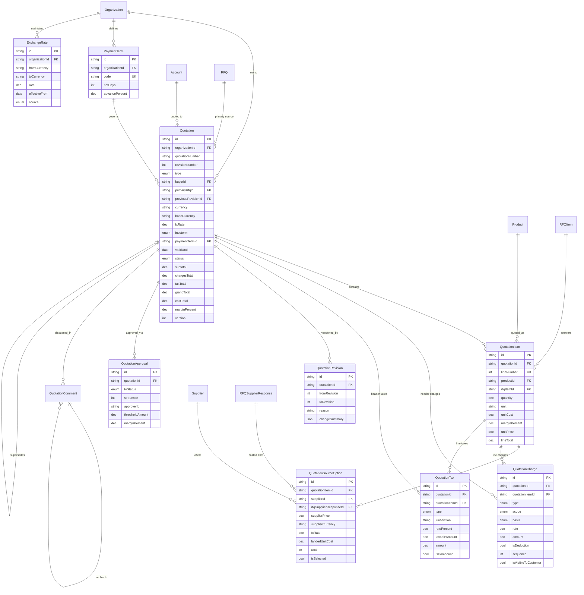

# Quotation Engine - Sprint 5 Domain Model

Enterprise quotation engine: costing, commercial terms, multi-currency, approval and
customer quotation generation.

Design deliverable only. **No APIs, no UI, no services, no repositories, no migrations.**

---

## 0. Collision validation (performed before the schema was written)

All existing names were enumerated across the four completed designs - **88 distinct names**:

| Source                  | Count | Names                                                                                                                                                                                                             |
| ----------------------- | ----: | ----------------------------------------------------------------------------------------------------------------------------------------------------------------------------------------------------------------- |
| **Frozen** (`main`)     |    38 | Account, Activity, AuditLog, BuyerProfile, Document, Notification\*, Organization, SupplierProfile, SupplierProduct, User, Verification\*, ...                                                                    |
| **Product Catalog**     |    14 | Category, Product, ProductPrice, ProductSpecification\*, Tag, `Incoterm`, `ProductStatus`, `DataType`, `ImageType`, `ProductDocumentType`                                                                         |
| **Supplier Management** |    22 | Supplier, SupplierContact/Address/BankAccount/Certification/Document, SupplierProductOffering, SupplierCapacity, SupplierPerformance, SupplierApproval, SupplierTag, `CertificationType`, `ApprovalDecision`, ... |
| **RFQ Management**      |    14 | RFQ, RFQItem, RFQSupplier, RFQSupplierResponse, RFQAttachment, RFQComment, RFQRevision, RFQApproval, `RFQStatus`, `RFQApprovalStatus`, ...                                                                        |

### Result: zero collisions. Nothing renamed.

All ten proposed models (`Quotation`, `QuotationItem`, `QuotationCharge`, `QuotationTax`,
`QuotationSourceOption`, `QuotationRevision`, `QuotationApproval`, `QuotationComment`,
`PaymentTerm`, `ExchangeRate`) and all eight proposed enums are free.

### Entities reused rather than re-declared

| Reused                                  | From                | Used for                               |
| --------------------------------------- | ------------------- | -------------------------------------- |
| `Incoterm`                              | Product Catalog     | Quotation header, source options       |
| `CertificationType`                     | Supplier Management | `QuotationItem.requiredCertifications` |
| `Product`                               | Product Catalog     | Quoted lines                           |
| `Supplier`                              | Supplier Management | Sourcing options                       |
| `Account` (**frozen**)                  | Frozen              | The customer being quoted              |
| `Organization` (**frozen**)             | Frozen              | Tenant scope                           |
| `RFQ`, `RFQItem`, `RFQSupplierResponse` | RFQ Management      | Sourcing provenance                    |

Frozen models gain only **column-less back-relations** (ADR-0007 pattern); no frozen table
gains a column.

### Deliberately generic enum names - a decision, not an oversight

`ChargeType`, `ChargeCalculationBasis`, `ChargeScope` and `TaxType` are **not** prefixed
`Quotation*`. Purchase Orders, Invoices and Shipments need exactly the same vocabulary: a
freight charge on a PO is the same concept as a freight charge on a quotation.

Prefixing them here would force every later module to redeclare or alias them - which is
precisely the mistake that produced the frozen `SupplierProduct` name clash in Sprint 3.
A vocabulary that will be shared is declared **once, generically, at first use**.
`PaymentTerm` and `ExchangeRate` are cross-cutting master data for the same reason.

### Validation result

Assembled onto the complete project - frozen + Catalog + Supplier + RFQ + Quotation - and
compiled:

```
prisma format   -> ok
prisma validate -> The schema is valid
                   60 models, 46 enums (10 new quotation models, 8 new enums)
```

Reuse was verified as necessary, not merely convenient: re-declaring `Incoterm` or
`CertificationType` fails with
`P1012: The enum "<name>" cannot be defined because a enum with that name already exists`.

---

## 1. Prisma schema

```prisma
// ==========================================================================
// ENUMS  (Incoterm and CertificationType are REUSED, not declared here)
// ==========================================================================

enum QuotationType {
  BUDGETARY
  FIRM
  PROFORMA
}

/// Commercial lifecycle. SUPERSEDED marks a revision replaced by a later one.
enum QuotationStatus {
  DRAFT
  PENDING_APPROVAL
  APPROVED
  SENT
  UNDER_NEGOTIATION
  ACCEPTED
  REJECTED
  EXPIRED
  WITHDRAWN
  SUPERSEDED
}

/// Approval workflow states. Separate from QuotationStatus: approval governs
/// whether the quotation may be sent, status governs where it is commercially.
enum QuotationApprovalStatus {
  DRAFT
  PENDING
  APPROVED
  REJECTED
  CANCELLED
}

/// Shared vocabulary - see section 0. Reused by Purchase Orders and Invoices.
enum ChargeType {
  FREIGHT
  INSURANCE
  PACKING
  SAMPLING
  HANDLING
  INSPECTION
  CERTIFICATION
  DOCUMENTATION
  BANK_CHARGES
  DISCOUNT
  SURCHARGE
  OTHER
}

enum ChargeCalculationBasis {
  FIXED_AMOUNT
  PERCENTAGE
  PER_UNIT
  PER_WEIGHT
  PER_CONTAINER
}

enum ChargeScope {
  HEADER
  LINE
}

enum TaxType {
  GST
  IGST
  CGST
  SGST
  VAT
  CUSTOMS_DUTY
  CESS
  WITHHOLDING
  OTHER
}

enum ExchangeRateSource {
  MANUAL
  RBI
  ECB
  MARKET_FEED
  IMPORTED
}

// ==========================================================================
// CROSS-CUTTING MASTER DATA
// ==========================================================================

/// Payment terms as master data. The frozen SupplierProfile carries
/// `paymentTerms String[]`; this upgrades the concept to a referenceable entity
/// without touching that field - see section 3.7.
model PaymentTerm {
  id             String @id @default(cuid())
  organizationId String

  /// e.g. "TT30", "LC_AT_SIGHT", "DP".
  code        String
  name        String
  description String?

  /// Net days from invoice. Null for at-sight / LC style terms.
  netDays        Int?
  advancePercent Decimal? @db.Decimal(5, 2)

  isActive  Boolean @default(true)
  sortOrder Int     @default(0)

  version   Int       @default(1)
  createdAt DateTime  @default(now())
  updatedAt DateTime  @updatedAt
  deletedAt DateTime?

  organization Organization @relation(fields: [organizationId], references: [id], onDelete: Cascade)
  quotations   Quotation[]

  @@unique([organizationId, code])
  @@index([organizationId, isActive, sortOrder])
}

/// Temporal FX rates. A quotation freezes the rate it used - see section 3.5.
model ExchangeRate {
  id             String @id @default(cuid())
  organizationId String

  /// ISO 4217.
  fromCurrency String @db.Char(3)
  toCurrency   String @db.Char(3)
  /// High precision: 8 dp is the practical floor for JPY/IDR style pairs.
  rate         Decimal @db.Decimal(18, 8)

  effectiveFrom DateTime
  effectiveTo   DateTime?
  source        ExchangeRateSource @default(MANUAL)

  createdById String?
  createdAt   DateTime @default(now())
  updatedAt   DateTime @updatedAt

  organization Organization @relation(fields: [organizationId], references: [id], onDelete: Cascade)

  @@unique([organizationId, fromCurrency, toCurrency, effectiveFrom])
  @@index([organizationId, fromCurrency, toCurrency, effectiveFrom])
  @@index([organizationId, effectiveFrom])
}

// ==========================================================================
// QUOTATION - one row PER REVISION (see section 3.3)
// ==========================================================================

model Quotation {
  id             String @id @default(cuid())
  organizationId String

  /// Stable across revisions, e.g. "QT-2026-000118".
  quotationNumber String
  revisionNumber  Int    @default(1)

  type QuotationType @default(FIRM)

  /// The customer being quoted. Frozen Account.
  buyerId String

  /// Convenience pointer when a quotation came from a single RFQ. The
  /// authoritative, per-line provenance is QuotationItem.rfqItemId, which is
  /// what allows one quotation to draw on SEVERAL RFQs - see section 3.2.
  primaryRfqId String?

  title       String?
  description String? @db.Text

  /// Revision chaining. Immutable once SENT.
  previousRevisionId String? @unique
  supersededAt       DateTime?

  // ---- Commercial terms ----
  /// Currency the customer is quoted in. ISO 4217.
  currency     String  @db.Char(3)
  /// Tenant reporting currency, for analytics without re-conversion.
  baseCurrency String  @db.Char(3)
  /// FX rate frozen at issue - never re-derived - see section 3.5.
  fxRate       Decimal? @db.Decimal(18, 8)
  fxRateDate   DateTime?

  incoterm           Incoterm?
  namedPlace         String?
  destinationCountry String?   @db.Char(2)
  destinationPort    String?

  paymentTermId    String?
  /// Free-text override when the agreed wording differs from the master term.
  paymentTermsText String?

  leadTimeDays   Int?
  packingSummary String?
  samplingTerms  String?

  validFrom  DateTime?
  validUntil DateTime?

  status QuotationStatus @default(DRAFT)

  // ---- Stored monetary roll-ups (see section 3.4) ----
  subtotal      Decimal? @db.Decimal(18, 4)
  chargesTotal  Decimal? @db.Decimal(18, 4)
  discountTotal Decimal? @db.Decimal(18, 4)
  taxTotal      Decimal? @db.Decimal(18, 4)
  grandTotal    Decimal? @db.Decimal(18, 4)
  /// INTERNAL: sourced cost and realised margin. Never rendered to the customer.
  costTotal     Decimal? @db.Decimal(18, 4)
  marginPercent Decimal? @db.Decimal(9, 4)

  sentAt          DateTime?
  acceptedAt      DateTime?
  rejectedAt      DateTime?
  rejectionReason String?

  createdById String
  updatedById String?
  deletedById String?

  version   Int       @default(1)
  createdAt DateTime  @default(now())
  updatedAt DateTime  @updatedAt
  deletedAt DateTime?

  organization     Organization        @relation(fields: [organizationId], references: [id], onDelete: Cascade)
  buyer            Account             @relation(fields: [buyerId], references: [id], onDelete: Restrict)
  primaryRfq       RFQ?                @relation(fields: [primaryRfqId], references: [id], onDelete: SetNull)
  paymentTerm      PaymentTerm?        @relation(fields: [paymentTermId], references: [id], onDelete: Restrict)
  previousRevision Quotation?          @relation("QuotationRevisionChain", fields: [previousRevisionId], references: [id], onDelete: SetNull)
  nextRevision     Quotation?          @relation("QuotationRevisionChain")

  items       QuotationItem[]
  charges     QuotationCharge[]
  taxes       QuotationTax[]
  revisions   QuotationRevision[]
  approvals   QuotationApproval[]
  comments    QuotationComment[]

  @@unique([organizationId, quotationNumber, revisionNumber])
  @@index([organizationId, status, deletedAt])
  @@index([organizationId, buyerId, status])
  @@index([organizationId, validUntil])
  @@index([organizationId, quotationNumber])
  @@index([organizationId, createdAt])
  @@index([primaryRfqId])
  @@index([buyerId])
  @@index([paymentTermId])
}

// ==========================================================================
// LINES
// ==========================================================================

model QuotationItem {
  id             String @id @default(cuid())
  quotationId    String
  organizationId String

  lineNumber Int

  productId         String?
  customProductName String?
  description       String? @db.Text

  /// Per-line provenance. This is what lets ONE quotation answer lines drawn
  /// from SEVERAL RFQs - see section 3.2.
  rfqItemId String?

  quantity Decimal @db.Decimal(18, 4)
  unit     String

  /// Sourced cost per unit, already converted into the quotation currency.
  /// INTERNAL - never rendered to the customer.
  unitCost      Decimal? @db.Decimal(18, 4)
  marginPercent Decimal? @db.Decimal(9, 4)

  unitPrice    Decimal @db.Decimal(18, 4)
  lineSubtotal Decimal @db.Decimal(18, 4)
  /// After line-scoped charges, discounts and taxes.
  lineTotal    Decimal @db.Decimal(18, 4)

  packaging              String?
  hsCode                 String?
  countryOfOrigin        String?             @db.Char(2)
  requiredCertifications CertificationType[]
  leadTimeDays           Int?
  remarks                String?

  version   Int       @default(1)
  createdAt DateTime  @default(now())
  updatedAt DateTime  @updatedAt
  deletedAt DateTime?

  quotation     Quotation               @relation(fields: [quotationId], references: [id], onDelete: Cascade)
  product       Product?                @relation(fields: [productId], references: [id], onDelete: SetNull)
  rfqItem       RFQItem?                @relation(fields: [rfqItemId], references: [id], onDelete: SetNull)
  sourceOptions QuotationSourceOption[]
  charges       QuotationCharge[]
  taxes         QuotationTax[]

  @@unique([quotationId, lineNumber])
  @@index([quotationId])
  @@index([organizationId, productId])
  @@index([rfqItemId])
  @@index([quotationId, deletedAt])
}

/// Candidate suppliers evaluated for one quoted line. This single model provides
/// price comparison, supplier comparison AND winner selection - section 3.6.
model QuotationSourceOption {
  id              String @id @default(cuid())
  quotationItemId String
  organizationId  String
  supplierId      String

  /// The specific supplier bid this option is costed from, when the quotation
  /// was sourced through an RFQ.
  rfqSupplierResponseId String?

  /// Supplier's quoted terms, denormalised at evaluation time so the comparison
  /// stays reproducible even if the bid is later revised.
  supplierPrice    Decimal  @db.Decimal(18, 4)
  supplierCurrency String   @db.Char(3)
  fxRate           Decimal? @db.Decimal(18, 8)

  /// Converted and loaded with freight/duty: the only number that is
  /// legitimately comparable across suppliers - see section 3.6.
  landedUnitCost Decimal @db.Decimal(18, 4)

  moq          Decimal?  @db.Decimal(18, 4)
  leadTimeDays Int?
  incoterm     Incoterm?
  port         String?

  /// 1 = best on landed cost. Recomputed on evaluation.
  rank Int?

  /// The winner. Exactly one per line, enforced by a partial unique index.
  isSelected      Boolean   @default(false)
  selectionReason String?
  selectedById    String?
  selectedAt      DateTime?

  version   Int       @default(1)
  createdAt DateTime  @default(now())
  updatedAt DateTime  @updatedAt
  deletedAt DateTime?

  quotationItem       QuotationItem        @relation(fields: [quotationItemId], references: [id], onDelete: Cascade)
  supplier            Supplier             @relation(fields: [supplierId], references: [id], onDelete: Restrict)
  rfqSupplierResponse RFQSupplierResponse? @relation(fields: [rfqSupplierResponseId], references: [id], onDelete: SetNull)

  @@unique([quotationItemId, supplierId])
  /// The comparison query: rank suppliers for a line by landed cost.
  @@index([quotationItemId, landedUnitCost])
  @@index([quotationItemId, isSelected])
  @@index([organizationId, supplierId])
  @@index([rfqSupplierResponseId])
}

// ==========================================================================
// PRICING CONDITIONS: charges, discounts, taxes
// ==========================================================================

/// Freight, insurance, packing, sampling, handling AND discounts, as one
/// ordered condition table rather than five near-identical ones - section 3.8.
model QuotationCharge {
  id             String @id @default(cuid())
  quotationId    String
  organizationId String

  /// Null for a header charge; set for a line charge.
  quotationItemId String?

  type  ChargeType
  scope ChargeScope            @default(HEADER)
  basis ChargeCalculationBasis @default(FIXED_AMOUNT)
  label String?

  /// Percentage or per-unit rate, depending on `basis`.
  rate   Decimal? @db.Decimal(12, 6)
  /// Resolved money amount. Stored - see section 3.4.
  amount Decimal  @db.Decimal(18, 4)
  currency String @db.Char(3)

  /// True for DISCOUNT and any other deduction; the amount is then subtracted.
  isDeduction Boolean @default(false)
  /// Evaluation order. Charges may stack on earlier charges.
  sequence    Int     @default(0)

  /// Whether the customer sees this broken out, or it is absorbed into
  /// unit price - see section 3.9.
  isVisibleToCustomer Boolean @default(true)
  notes               String?

  version   Int       @default(1)
  createdAt DateTime  @default(now())
  updatedAt DateTime  @updatedAt
  deletedAt DateTime?

  quotation     Quotation      @relation(fields: [quotationId], references: [id], onDelete: Cascade)
  quotationItem QuotationItem? @relation(fields: [quotationItemId], references: [id], onDelete: Cascade)

  @@index([quotationId, scope, sequence])
  @@index([quotationItemId])
  @@index([organizationId, type])
}

/// Taxes are modelled separately from charges because they carry jurisdiction,
/// compounding and reverse-charge semantics charges do not - section 3.8.
model QuotationTax {
  id             String @id @default(cuid())
  quotationId    String
  organizationId String

  quotationItemId String?

  type         TaxType
  /// e.g. "IGST-18".
  code         String?
  /// Country or state whose rule applies.
  jurisdiction String?

  ratePercent   Decimal @db.Decimal(9, 4)
  taxableAmount Decimal @db.Decimal(18, 4)
  amount        Decimal @db.Decimal(18, 4)
  currency      String  @db.Char(3)

  /// Tax levied on a base that already includes an earlier tax.
  isCompound      Boolean @default(false)
  isReverseCharge Boolean @default(false)
  sequence        Int     @default(0)

  version   Int       @default(1)
  createdAt DateTime  @default(now())
  updatedAt DateTime  @updatedAt
  deletedAt DateTime?

  quotation     Quotation      @relation(fields: [quotationId], references: [id], onDelete: Cascade)
  quotationItem QuotationItem? @relation(fields: [quotationItemId], references: [id], onDelete: Cascade)

  @@index([quotationId, sequence])
  @@index([quotationItemId])
  @@index([organizationId, type])
}

// ==========================================================================
// HISTORY, APPROVAL, INTERNAL NOTES
// ==========================================================================

/// Why a revision happened. The full prior state is the previous Quotation row,
/// so this records the CHANGE, not a snapshot - section 3.3.
model QuotationRevision {
  id             String @id @default(cuid())
  organizationId String
  /// The revision row this record introduced.
  quotationId    String

  fromRevision Int?
  toRevision   Int
  reason       String?
  /// Field-level summary of what moved between revisions.
  changeSummary Json?

  changedById String
  changedAt   DateTime @default(now())
  createdAt   DateTime @default(now())

  quotation Quotation @relation(fields: [quotationId], references: [id], onDelete: Cascade)

  @@unique([quotationId, toRevision])
  @@index([organizationId, changedAt])
}

/// Append-only approval history. Current state is denormalised on
/// Quotation.status.
model QuotationApproval {
  id             String @id @default(cuid())
  organizationId String
  quotationId    String

  fromStatus QuotationApprovalStatus?
  toStatus   QuotationApprovalStatus
  /// Step order for multi-level chains.
  sequence   Int                      @default(1)

  approverId String
  /// The value threshold that made this approval step necessary, recorded so an
  /// auditor can see WHY approval was required, not just that it happened.
  thresholdAmount Decimal? @db.Decimal(18, 4)
  /// Margin at the time of decision - the number approvers actually judge.
  marginPercent   Decimal? @db.Decimal(9, 4)

  comments  String?
  decidedAt DateTime @default(now())
  createdAt DateTime @default(now())

  quotation Quotation @relation(fields: [quotationId], references: [id], onDelete: Cascade)

  @@index([quotationId, decidedAt])
  @@index([organizationId, toStatus])
  @@index([organizationId, approverId])
}

/// Internal-only, threaded. Same contract as RFQComment.
model QuotationComment {
  id             String @id @default(cuid())
  organizationId String
  quotationId    String

  parentId String?
  authorId String
  body     String  @db.Text

  isInternal Boolean   @default(true)
  editedAt   DateTime?

  version   Int       @default(1)
  createdAt DateTime  @default(now())
  updatedAt DateTime  @updatedAt
  deletedAt DateTime?

  quotation Quotation          @relation(fields: [quotationId], references: [id], onDelete: Cascade)
  parent    QuotationComment?  @relation("QuotationCommentThread", fields: [parentId], references: [id], onDelete: Cascade)
  replies   QuotationComment[] @relation("QuotationCommentThread")

  @@index([quotationId, createdAt])
  @@index([parentId])
  @@index([organizationId, authorId])
}
```

### Back-relations required elsewhere (column-less, no table changes)

```prisma
model Organization        { quotations Quotation[]  paymentTerms PaymentTerm[]  exchangeRates ExchangeRate[] }
model Account             { quotations Quotation[] }                       // frozen - ORM only
model Product             { quotationItems QuotationItem[] }
model Supplier            { quotationSourceOptions QuotationSourceOption[] }
model RFQ                 { quotations Quotation[] }
model RFQItem             { quotationItems QuotationItem[] }
model RFQSupplierResponse { quotationSourceOptions QuotationSourceOption[] }
```

### Constraints for the migration phase (Prisma cannot express these)

1. **Exactly one selected supplier per line** - partial unique on
   `QuotationSourceOption(quotationItemId) WHERE "isSelected" AND "deletedAt" IS NULL`.
2. **A line is a catalog product or free text** -
   `CHECK ("productId" IS NOT NULL OR "customProductName" IS NOT NULL)`.
3. **Non-overlapping FX validity** per currency pair - `EXCLUDE USING gist` over
   `tsrange(effectiveFrom, effectiveTo)`, requires `btree_gist`.
4. **Validity sanity** - `CHECK ("validUntil" IS NULL OR "validFrom" IS NULL OR "validUntil" > "validFrom")`.
5. **Money bounds** - `CHECK ("quantity" > 0)`, `CHECK ("unitPrice" >= 0)`,
   `CHECK ("ratePercent" BETWEEN 0 AND 100)`.
6. **Comments internal** - `CHECK ("isInternal")`.
7. **Full-text search** - GIN expression index over
   `to_tsvector('english'::regconfig, quotationNumber || coalesce(title,''))`, plus
   `pg_trgm` on `quotationNumber`. The `'english'::regconfig` cast is mandatory - without
   it the single-argument overload is only STABLE and Postgres rejects the index with `42P17`.
8. **Live-row partial indexes** on `Quotation` (`WHERE "deletedAt" IS NULL`).

---

## 2. ER diagram



---

## 3. Architecture decisions

### 3.1 Inbound bid and outbound quotation are different things

This is the decision the whole module rests on. `RFQSupplierResponse` (Sprint 4) is a
supplier bidding **to** Triyara. `Quotation` is Triyara quoting **to** a customer. They look
superficially similar - both have price, currency, incoterm, validity - and collapsing them
into one "quotation" table is the single most common cause of a procurement redesign.

They are kept apart because they differ in every way that matters: different counterparty,
opposite direction of obligation, different approval chain, and different lifecycle (a bid
is evaluated, a quotation is negotiated and accepted). `QuotationSourceOption` is the
explicit bridge between them, so the relationship is modelled rather than assumed.

### 3.2 Provenance is per line, which is what supports "multiple RFQs"

`QuotationItem.rfqItemId` links each quoted line to the RFQ line it answers.
`Quotation.primaryRfqId` is only a convenience pointer for the common single-RFQ case.

Because provenance lives on the line, one quotation can legitimately combine lines sourced
from several RFQs - a real scenario when a customer's order spans commodities that were
sourced separately. A header-only `rfqId` would have made that impossible without redesign.

### 3.3 One row per revision, and the revision table records the _change_

Each revision of a customer quotation is a distinct commercial document that was sent and
may have been acted on. Overwriting rev 1 to produce rev 2 destroys a record someone may
have relied upon.

So `Quotation` is keyed `(organizationId, quotationNumber, revisionNumber)` - one row per
revision, chained by `previousRevisionId`, with superseded rows marked `SUPERSEDED`.

That makes a snapshot table redundant: **the previous revision row _is_ the snapshot.**
`QuotationRevision` therefore records the _change_ - who, when, why, and a field-level
`changeSummary` - rather than duplicating state. This is deliberately different from
`RFQRevision`, which does store snapshots, because an RFQ mutates in place while a quotation
forks.

### 3.4 Totals are stored, not computed on read

`subtotal`, `chargesTotal`, `taxTotal`, `grandTotal`, `costTotal`, `marginPercent` are
persisted. Recomputing at read time would mean an accepted quotation's total silently
changes when a tax rate, FX rate or charge rule is later edited.

A sent quotation is a commercial commitment; its arithmetic must be frozen. Charge and tax
`amount` columns are stored for the same reason, alongside the `rate` that produced them, so
the calculation is auditable rather than merely reproducible.

### 3.5 FX rates are temporal master data, and the used rate is frozen

`ExchangeRate` is org-scoped and time-ranged with a `source`, so "what rate did we use on 4
March?" is answerable. `Quotation.fxRate` + `fxRateDate` freeze the rate actually applied,
and `QuotationSourceOption.fxRate` freezes the rate used to compare that supplier.

Storing only a reference to the rate table would re-expose the quotation to later rate
corrections. `Decimal(18,8)` because 8 decimal places is the practical floor for pairs like
JPY or IDR.

### 3.6 Landed cost is the only comparable number

Comparing supplier quotes on headline price is wrong: one supplier quotes FOB in USD, another
CIF in EUR with a different MOQ and lead time. `QuotationSourceOption.landedUnitCost` is the
converted, freight- and duty-loaded figure, and it is the column the comparison index is
built on.

Supplier terms are **denormalised onto the option row** at evaluation time so the comparison
stays reproducible even if the underlying bid is later revised - the evaluation is a record
of a decision, not a live view.

One model therefore delivers three requested capabilities: price comparison (order by
`landedUnitCost`), supplier comparison (options per line), and winner selection
(`isSelected`, with a partial unique index guaranteeing exactly one winner per line).

### 3.7 `PaymentTerm` is master data, and it does not disturb the frozen field

The frozen `SupplierProfile.paymentTerms` is a `String[]`. Rather than modify it, payment
terms become a referenceable entity with `netDays` and `advancePercent` so the engine can
actually compute due dates and advance amounts. The frozen array keeps working untouched;
new work references the entity. `Quotation.paymentTermsText` allows a negotiated wording that
differs from the master term without corrupting it.

### 3.8 Charges are one ordered condition table; taxes are separate

Freight, insurance, packing, sampling, handling and discounts share identical mechanics -
a type, a basis (fixed / percentage / per-unit / per-weight / per-container), a scope
(header or line), an evaluation `sequence` and a resolved amount. Modelling them as five
near-identical tables would triple the join count on every total, and adding a sixth charge
kind would need a schema change; here it is one enum member. This is the condition technique
SAP uses, deliberately.

Discounts are charges with `isDeduction = true`, not a separate table.

**Taxes are separated** because they genuinely differ: jurisdiction, compounding (tax on a
base that already includes tax) and reverse charge have no analogue in freight. Forcing them
into the charge table would mean nullable tax-only columns on every freight row.

### 3.9 `isVisibleToCustomer` is a commercial control, not cosmetics

A quotation may show freight as a separate line or absorb it into unit price - a negotiating
decision, and a different document in each case. Internal cost, margin and unabsorbed
charges must never surface to the buyer. `unitCost`, `marginPercent` and `costTotal` are
marked INTERNAL in the schema comments; `isVisibleToCustomer` controls per-charge disclosure.

### 3.10 Approval records the _reason_ it was required

`QuotationApproval` stores `thresholdAmount` and `marginPercent` alongside the decision.
Six months later "why did this need director sign-off?" is answerable from the row itself,
rather than requiring the approval-policy configuration as it stood that day to be
reconstructed. Append-only, like every other governance table in the platform.

### 3.11 Tenant isolation, versioning, soft delete - except history

`organizationId` everywhere, `version` for the ETag/If-Match → 412 path, `deletedAt` on every
mutable table. `QuotationRevision` and `QuotationApproval` are the deliberate exceptions on
all three: an audit record you can edit or delete is not an audit record.

---

## 4. Performance strategy

1. **Tenant-leading composite indexes** throughout, so index locality follows tenant
   locality.
2. **Stored roll-ups eliminate the dominant aggregate.** A quotation list showing
   `grandTotal` and `marginPercent` needs no sum over items, charges and taxes - the
   classic three-way N+1 in this domain is designed out rather than optimised later.
3. **The comparison query is index-only**: `@@index([quotationItemId, landedUnitCost])`
   ranks suppliers for a line without touching the bid tables.
4. **Winner lookup is a single indexed probe** via `(quotationItemId, isSelected)` plus the
   partial unique index.
5. **FX lookup is a range scan** on `(organizationId, fromCurrency, toCurrency,
effectiveFrom)` - top-1, no scan of rate history.
6. **Expiry sweeps are indexed** on `(organizationId, validUntil)`.
7. **Two projections.** A narrow list `select` (number, revision, buyer, status, grandTotal,
   validUntil) that never touches `description` or `changeSummary`; a wide detail `select`
   for the quotation workspace. `Json` columns stay out of lists.
8. **Charges and taxes are read by `(quotationId, sequence)`**, so the pricing engine walks
   conditions in evaluation order with one ordered index read.
9. **Cursor pagination only**, reusing the platform's keyset helper.

---

## 5. Scalability strategy

- **`QuotationSourceOption` is the fan-out table** - quotations x lines x candidate
  suppliers. It is always read via `quotationItemId`, the leading index column, so growth is
  absorbed by the index. It is the natural first candidate for archival once a quotation is
  ACCEPTED or EXPIRED, since the selected option is the only one with lasting meaning.
- **Revisions grow the `Quotation` table rather than a side table.** That is a deliberate
  trade: it keeps every revision a first-class, indexable, queryable document at the cost of
  more rows. Superseded rows are excluded from live queries by the partial index, so the hot
  set stays proportional to _current_ quotations.
- **Charges and taxes are bounded per quotation** (tens of rows), so they never dominate.
- **Append-only history tables** never suffer update contention and scale on writes
  independently of the live workload.
- **Read/write asymmetry**: quotation dashboards read far more than they write, and no read
  path depends on a write-side lock, so a read replica or cached comparison projection drops
  in later with no schema change.
- **Multi-currency is already normalised into `baseCurrency`**, so analytics aggregates
  across currencies without re-conversion at query time - the usual reason reporting layers
  get rebuilt.

---

## 6. Forward compatibility - no redesign required

The quotation is the **commitment record**. Everything downstream points at it and never
modifies it; `Quotation.id` is the stable key and `(quotationNumber, revisionNumber)` the
stable human identifier.

| Module              | How it attaches                                                                                                          | Why it is additive                                                                                                                                                                                                               |
| ------------------- | ------------------------------------------------------------------------------------------------------------------------ | -------------------------------------------------------------------------------------------------------------------------------------------------------------------------------------------------------------------------------- |
| **Purchase Orders** | `PurchaseOrder(quotationId, supplierId, quotationSourceOptionId)` + `POLine(quotationItemId, productId, qty, unitPrice)` | The selected `QuotationSourceOption` already names the winning supplier at the winning landed cost, so a PO is raised **from** the selection rather than re-sourced. Charges/taxes reuse `ChargeType`/`TaxType` verbatim.        |
| **Shipment**        | `Shipment(purchaseOrderId, incoterm, namedPlace, destinationPort)`                                                       | Incoterm, named place and destination are already on the quotation in the **shared** `Incoterm` vocabulary, so terms flow through the chain without translation.                                                                 |
| **Finance**         | `Invoice(quotationId, purchaseOrderId, currency, fxRate)`, `Payment(paymentTermId, dueDate)`                             | `PaymentTerm.netDays`/`advancePercent` make due dates computable; the frozen FX rate makes revenue recognition and FX gain/loss reproducible; `Decimal(18,4)` throughout means no precision change is needed.                    |
| **Analytics**       | Reads `costTotal`, `marginPercent`, `baseCurrency` and the `QuotationSourceOption` history directly                      | Margin and base-currency totals are already stored per quotation, so win/loss, realised margin and supplier-competitiveness reporting need **no new columns and no re-conversion** - the usual trigger for a warehouse redesign. |

Four properties make all four additive:

- **The quotation owns no fulfilment state** - no stock, no shipments, no payments.
- **Identifiers are permanent** - soft delete plus never-reused `quotationNumber`, and
  revisions are additive rows, so no downstream foreign key can dangle or silently change
  meaning.
- **Shared vocabularies are declared once** - `Incoterm`, `CertificationType`, `ChargeType`,
  `TaxType`, `PaymentTerm`, `ExchangeRate` are all reusable by later modules by design
  (section 0).
- **Extension over modification** - every downstream module adds its own tables with keys
  pointing inward, exactly as this module does to Catalog, Supplier, RFQ and the frozen
  modules.

---

## 7. Deliberately out of scope

No APIs, no UI, no services, no repositories, no migrations and no seed data are produced by
this document, per the Sprint 5 brief. Frozen modules, Product Catalog, Supplier Management
and RFQ Management are referenced but not modified.
