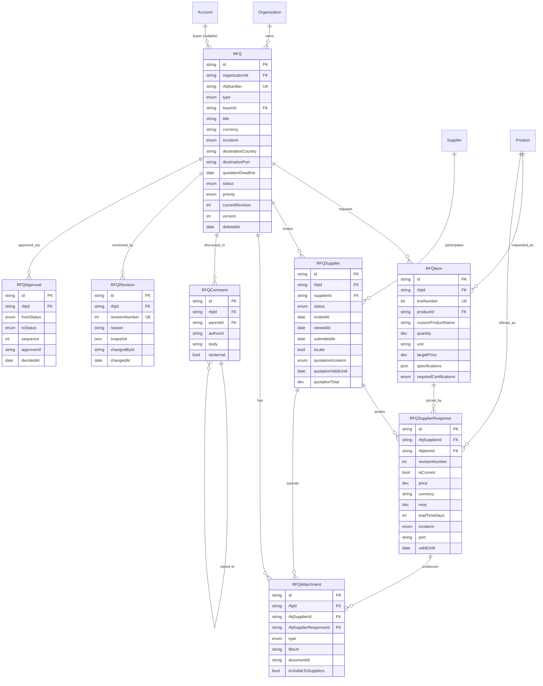

# RFQ Management - Sprint 4 Domain Model

Enterprise sourcing domain for the Triyara Business Network Platform: buyer and internal
Requests For Quotation, supplier invitation and response, revision history and approval.

Design deliverable only. **No APIs, no UI, no services, no repositories, no migrations.**

---

## 0. Collision validation (performed before the schema was written)

Every existing model and enum name was enumerated across the three sources that already
exist, then checked against the eight requested models and the enums they need.

| Source                                                  | Contents                                                                                                                                                                                         |
| ------------------------------------------------------- | ------------------------------------------------------------------------------------------------------------------------------------------------------------------------------------------------ |
| **Frozen modules** (`main`)                             | 22 models, 16 enums - Account, User, Document, Verification, Activity, Notification, SupplierProfile, SupplierProduct, BuyerProfile, ...                                                         |
| **Product Catalog** (`feature/product-catalog-sprint1`) | Category, Product, ProductSpecification(+Definition), ProductImage, ProductDocument, ProductPrice, Tag, ProductTag + `Incoterm`, `ProductStatus`, `DataType`, `ImageType`, `ProductDocumentType` |
| **Supplier Management** (`TRY-BNP-SUPPLIER-02`)         | Supplier, SupplierContact/Address/BankAccount/Certification/Document, SupplierProductOffering, SupplierCapacity, SupplierPerformance, SupplierApproval, SupplierTag + 11 enums                   |

### Result: the eight requested MODEL names are all clear

`RFQ`, `RFQItem`, `RFQSupplier`, `RFQSupplierResponse`, `RFQAttachment`, `RFQComment`,
`RFQRevision`, `RFQApproval` - **no collisions**. Nothing is renamed.

### Three ENUM collisions, all resolved by reuse rather than renaming

| Enum needed         | Collision                                                                                                                | Resolution                                                                                                                                                                                                                    |
| ------------------- | ------------------------------------------------------------------------------------------------------------------------ | ----------------------------------------------------------------------------------------------------------------------------------------------------------------------------------------------------------------------------- |
| `Incoterm`          | **Owned by the Product Catalog** (Incoterms 2020, 11 rules)                                                              | **Reused as-is.** Redefining fails with `P1012`. RFQ, RFQSupplier and RFQSupplierResponse all reference the catalog enum.                                                                                                     |
| `CertificationType` | **Owned by Supplier Management** (ISO, FSSAI, HACCP, APEDA, FDA, BRCGS, HALAL, KOSHER, ORGANIC, GMP, SPICE_BOARD, OTHER) | **Reused as-is** for `RFQItem.requiredCertifications`. A buyer requiring "HACCP" must mean the same token a supplier holds, or matching silently fails.                                                                       |
| `ApprovalDecision`  | **Owned by Supplier Management** (SUBMITTED/APPROVED/REJECTED/BLOCKED/UNBLOCKED/REOPENED)                                | **Not reused, and not renamed either** - the RFQ brief asks for Draft/Pending/Approved/Rejected/Cancelled, which is a _status_, not a decision. A distinct `RFQApprovalStatus` is introduced. The supplier enum is untouched. |

> **Verified by compilation, not assumed.** Appending a redeclaration of each enum to the
> assembled project schema fails with
> `P1012: The enum "<name>" cannot be defined because a enum with that name already exists`
> for all three (`Incoterm`, `CertificationType`, `ApprovalDecision`). A control enum with a
> genuinely new name compiles cleanly, confirming the probe itself is sound.

### Models reused as foreign-key targets, never redefined

- `Product` (catalog) - requested line items and supplier-offered alternatives.
- `Supplier` (supplier module) - invited participants.
- `Account` (**frozen**) - the buyer on a buyer-originated RFQ.
- `Organization` (**frozen**) - tenant scope.

All four gain only **column-less back-relations**, the ORM-only pattern approved in
ADR-0007; no frozen table gains a column.

### Dependency note

This module has real foreign keys into both the Product Catalog and Supplier Management.
Supplier Management is currently **design-only** (`TRY-BNP-SUPPLIER-02` is a document, not
yet implemented), and the catalog branch is unmerged. **RFQ cannot migrate until both are
implemented and merged.**

### Validation result

The schema below was assembled onto the real project - frozen modules + Product Catalog +
Supplier Management - and compiled:

```
prisma format   -> ok
prisma validate -> The schema is valid
                   50 models, 38 enums, 8 RFQ models
```

---

## 1. Complete Prisma schema

```prisma
// ==========================================================================
// ENUMS  (Incoterm and CertificationType are REUSED, not declared here)
// ==========================================================================

/// Who the RFQ is raised for. A BUYER rfq has an external Account; an INTERNAL
/// rfq is Triyara sourcing on its own behalf and has no buyer.
enum RFQType {
  BUYER
  INTERNAL
}

/// Sourcing lifecycle. Distinct from the approval workflow (RFQApprovalStatus):
/// approval governs whether an RFQ may be issued, this governs where it is.
enum RFQStatus {
  DRAFT
  PENDING_APPROVAL
  APPROVED
  ISSUED
  IN_PROGRESS
  EVALUATING
  AWARDED
  CLOSED
  CANCELLED
  EXPIRED
}

enum RFQPriority {
  LOW
  NORMAL
  HIGH
  URGENT
}

/// Participation state of one invited supplier. Lateness is deliberately NOT a
/// member here - see section 3.4.
enum RFQSupplierStatus {
  INVITED
  VIEWED
  ACCEPTED
  DECLINED
  SUBMITTED
  NO_RESPONSE
  WITHDRAWN
}

enum RFQAttachmentType {
  SPECIFICATION
  DRAWING
  CERTIFICATE
  IMAGE
  PDF
  PRICE_SHEET
  OTHER
}

/// Approval workflow states, per the Sprint 4 brief. Deliberately separate from
/// the supplier module's ApprovalDecision, which models a different thing.
enum RFQApprovalStatus {
  DRAFT
  PENDING
  APPROVED
  REJECTED
  CANCELLED
}

// ==========================================================================
// RFQ - the sourcing request
// ==========================================================================

model RFQ {
  id             String @id @default(cuid())
  organizationId String

  /// Human key, e.g. "RFQ-2026-000431". Unique per tenant, never reused.
  rfqNumber String
  type      RFQType @default(BUYER)

  /// The external buyer. Null for INTERNAL RFQs - see section 3.1.
  buyerId String?

  title       String
  description String? @db.Text

  /// ISO 4217. The currency the RFQ is denominated in; suppliers may quote in
  /// another currency, which is why the response carries its own.
  currency           String?   @db.Char(3)
  incoterm           Incoterm?
  /// ISO 3166-1 alpha-2.
  destinationCountry String?   @db.Char(2)
  /// UN/LOCODE or named place.
  destinationPort    String?

  expectedShipmentDate DateTime?
  quotationDeadline    DateTime?

  status   RFQStatus   @default(DRAFT)
  priority RFQPriority @default(NORMAL)

  /// Pointer to the latest RFQRevision. Denormalised so the current revision is
  /// readable without an aggregate over history.
  currentRevision Int @default(1)

  createdById String
  updatedById String?
  deletedById String?

  version   Int       @default(1)
  createdAt DateTime  @default(now())
  updatedAt DateTime  @updatedAt
  deletedAt DateTime?

  organization Organization    @relation(fields: [organizationId], references: [id], onDelete: Cascade)
  buyer        Account?        @relation(fields: [buyerId], references: [id], onDelete: Restrict)
  items        RFQItem[]
  suppliers    RFQSupplier[]
  attachments  RFQAttachment[]
  comments     RFQComment[]
  revisions    RFQRevision[]
  approvals    RFQApproval[]

  @@unique([organizationId, rfqNumber])
  @@index([organizationId, status, deletedAt])
  @@index([organizationId, buyerId, status])
  @@index([organizationId, quotationDeadline])
  @@index([organizationId, destinationCountry, destinationPort])
  @@index([organizationId, priority, status])
  @@index([organizationId, createdAt])
  @@index([buyerId])
}

// ==========================================================================
// LINE ITEMS
// ==========================================================================

/// One requested line. Either a catalog product or a free-text request for
/// something not yet catalogued - see section 3.2.
model RFQItem {
  id             String @id @default(cuid())
  rfqId          String
  organizationId String

  lineNumber Int

  /// Catalog product. Null when the buyer asked for something not in the catalog.
  productId String?
  /// Used only when productId is null.
  customProductName        String?
  customProductDescription String? @db.Text

  quantity       Decimal  @db.Decimal(18, 4)
  unit           String
  targetPrice    Decimal? @db.Decimal(18, 4)
  targetCurrency String?  @db.Char(3)

  /// Buyer-stated specifications, e.g. {"moisture":"<8%","curcumin":">=3%"}.
  /// Free-form because a buyer may ask for attributes the catalog has no
  /// definition for yet - see section 3.3.
  specifications Json?

  /// Reuses the supplier module's CertificationType vocabulary so a required
  /// certification is directly comparable to what a supplier holds.
  requiredCertifications CertificationType[]

  packaging String?
  remarks   String?

  version   Int       @default(1)
  createdAt DateTime  @default(now())
  updatedAt DateTime  @updatedAt
  deletedAt DateTime?

  rfq       RFQ                   @relation(fields: [rfqId], references: [id], onDelete: Cascade)
  product   Product?              @relation(fields: [productId], references: [id], onDelete: SetNull)
  responses RFQSupplierResponse[]

  @@unique([rfqId, lineNumber])
  @@index([rfqId])
  @@index([organizationId, productId])
  @@index([rfqId, deletedAt])
}

// ==========================================================================
// SUPPLIER PARTICIPATION + RESPONSE
// ==========================================================================

/// One invited supplier's participation in one RFQ. This row doubles as the
/// header of that supplier's quotation - see section 3.5.
model RFQSupplier {
  id             String @id @default(cuid())
  rfqId          String
  supplierId     String
  organizationId String

  status      RFQSupplierStatus @default(INVITED)
  invitedById String
  invitedAt   DateTime          @default(now())
  viewedAt    DateTime?
  /// When the supplier accepted or declined the invitation.
  respondedAt DateTime?
  declineReason String?

  submittedAt DateTime?
  /// Denormalised at submit time: submittedAt > rfq.quotationDeadline.
  /// Kept as a flag rather than a status - see section 3.4.
  isLate      Boolean   @default(false)

  /// Quotation header. The per-line economics live in RFQSupplierResponse.
  quotationCurrency   String?   @db.Char(3)
  quotationIncoterm   Incoterm?
  quotationPort       String?
  quotationValidUntil DateTime?
  quotationRemarks    String?   @db.Text
  /// Denormalised sum of the response lines, for list ranking without an aggregate.
  quotationTotal      Decimal?  @db.Decimal(18, 4)

  version   Int       @default(1)
  createdAt DateTime  @default(now())
  updatedAt DateTime  @updatedAt
  deletedAt DateTime?

  rfq         RFQ                   @relation(fields: [rfqId], references: [id], onDelete: Cascade)
  supplier    Supplier              @relation(fields: [supplierId], references: [id], onDelete: Restrict)
  responses   RFQSupplierResponse[]
  attachments RFQAttachment[]

  @@unique([rfqId, supplierId])
  @@index([rfqId, status])
  @@index([organizationId, supplierId, status])
  @@index([organizationId, submittedAt])
  @@index([supplierId])
}

/// One priced line from one supplier against one RFQ item. Re-submissions create
/// a new revision row rather than overwriting, which is what makes price history
/// possible - see section 3.6.
model RFQSupplierResponse {
  id             String @id @default(cuid())
  rfqSupplierId  String
  rfqItemId      String
  organizationId String

  /// Increments on each re-submission for the same supplier/line.
  revisionNumber Int @default(1)
  /// Exactly one row per (supplier, line) has this set; enforced by a partial
  /// unique index at migration time.
  isCurrent      Boolean @default(true)

  price    Decimal  @db.Decimal(18, 4)
  currency String   @db.Char(3)
  moq      Decimal? @db.Decimal(18, 4)
  moqUnit  String?

  leadTimeDays Int?
  incoterm     Incoterm?
  port         String?

  /// When the supplier offers an alternative catalog product to the one asked for.
  offeredProductId   String?
  offeredDescription String?

  remarks    String?
  validUntil DateTime?

  submittedAt DateTime  @default(now())
  version     Int       @default(1)
  createdAt   DateTime  @default(now())
  updatedAt   DateTime  @updatedAt
  deletedAt   DateTime?

  rfqSupplier    RFQSupplier     @relation(fields: [rfqSupplierId], references: [id], onDelete: Cascade)
  rfqItem        RFQItem         @relation(fields: [rfqItemId], references: [id], onDelete: Cascade)
  offeredProduct Product?        @relation("RFQOfferedProduct", fields: [offeredProductId], references: [id], onDelete: SetNull)
  attachments    RFQAttachment[]

  @@unique([rfqSupplierId, rfqItemId, revisionNumber])
  /// The comparison query: cheapest current quote per line.
  @@index([rfqItemId, isCurrent, price])
  @@index([rfqSupplierId, isCurrent])
  @@index([organizationId, validUntil])
  @@index([offeredProductId])
}

// ==========================================================================
// ATTACHMENTS, COMMENTS, HISTORY, APPROVAL
// ==========================================================================

/// Metadata only. Attached to the RFQ itself, or to a supplier's submission, or
/// to one response line - see section 3.7.
model RFQAttachment {
  id             String @id @default(cuid())
  organizationId String
  rfqId          String

  /// Set when the file belongs to a supplier's submission rather than the RFQ.
  rfqSupplierId         String?
  rfqSupplierResponseId String?

  type  RFQAttachmentType @default(OTHER)
  title String?

  fileUrl    String
  storageKey String?
  mimeType   String?
  fileSize   Int?
  checksum   String?

  /// Seam to the FROZEN Document module, when the file needs access control
  /// and version history.
  documentId String?

  /// RFQ-side attachments are shared with invited suppliers unless cleared.
  /// Supplier-side attachments are never shown to other suppliers.
  isVisibleToSuppliers Boolean @default(true)

  uploadedById String
  version      Int       @default(1)
  createdAt    DateTime  @default(now())
  updatedAt    DateTime  @updatedAt
  deletedAt    DateTime?

  rfq                 RFQ                  @relation(fields: [rfqId], references: [id], onDelete: Cascade)
  rfqSupplier         RFQSupplier?         @relation(fields: [rfqSupplierId], references: [id], onDelete: Cascade)
  rfqSupplierResponse RFQSupplierResponse? @relation(fields: [rfqSupplierResponseId], references: [id], onDelete: Cascade)

  @@index([rfqId, type])
  @@index([rfqSupplierId])
  @@index([rfqSupplierResponseId])
  @@index([organizationId, deletedAt])
  @@index([documentId])
}

/// Internal discussion. Threaded. Never exposed to suppliers - section 3.8.
model RFQComment {
  id             String @id @default(cuid())
  organizationId String
  rfqId          String

  /// Null for a root comment; set for a reply.
  parentId String?

  authorId String
  body     String  @db.Text

  /// Always true today. Present as a column so the internal-only guarantee is
  /// visible in the data and enforceable by a CHECK, not only in service code.
  isInternal Boolean   @default(true)
  editedAt   DateTime?

  version   Int       @default(1)
  createdAt DateTime  @default(now())
  updatedAt DateTime  @updatedAt
  deletedAt DateTime?

  rfq     RFQ          @relation(fields: [rfqId], references: [id], onDelete: Cascade)
  parent  RFQComment?  @relation("RFQCommentThread", fields: [parentId], references: [id], onDelete: Cascade)
  replies RFQComment[] @relation("RFQCommentThread")

  @@index([rfqId, createdAt])
  @@index([parentId])
  @@index([organizationId, authorId])
  @@index([rfqId, deletedAt])
}

/// Append-only temporal history. One row per issued revision, carrying a full
/// snapshot of the RFQ and its items - see section 3.9.
model RFQRevision {
  id             String @id @default(cuid())
  organizationId String
  rfqId          String

  revisionNumber Int
  reason         String?
  /// Complete snapshot of the RFQ header and line items at this revision.
  snapshot       Json

  changedById String
  changedAt   DateTime @default(now())
  createdAt   DateTime @default(now())

  rfq RFQ @relation(fields: [rfqId], references: [id], onDelete: Cascade)

  @@unique([rfqId, revisionNumber])
  @@index([organizationId, changedAt])
  @@index([rfqId, changedAt])
}

/// Append-only approval history. One row per transition. The RFQ's current
/// state is denormalised on RFQ.status - see section 3.10.
model RFQApproval {
  id             String @id @default(cuid())
  organizationId String
  rfqId          String

  fromStatus RFQApprovalStatus?
  toStatus   RFQApprovalStatus
  /// Step order, for multi-level approval chains.
  sequence   Int                @default(1)

  approverId String
  comments   String?
  decidedAt  DateTime           @default(now())
  createdAt  DateTime           @default(now())

  rfq RFQ @relation(fields: [rfqId], references: [id], onDelete: Cascade)

  @@index([rfqId, decidedAt])
  @@index([organizationId, toStatus])
  @@index([organizationId, approverId])
}
```

### Back-relations required elsewhere (column-less, no table changes)

```prisma
model Organization { rfqs RFQ[] }                                  // frozen - ORM only
model Account      { rfqs RFQ[] }                                  // frozen - ORM only
model Product      { rfqItems RFQItem[]
                     rfqOfferedIn RFQSupplierResponse[] @relation("RFQOfferedProduct") }
model Supplier     { rfqParticipations RFQSupplier[] }
```

### Constraints for the migration phase (Prisma cannot express these)

Listed, not generated - migrations are out of scope:

1. **Exactly one current response per supplier/line** - partial unique index on
   `RFQSupplierResponse(rfqSupplierId, rfqItemId) WHERE "isCurrent" AND "deletedAt" IS NULL`.
2. **An RFQ item is either catalogued or custom** -
   `CHECK ("productId" IS NOT NULL OR "customProductName" IS NOT NULL)`.
3. **Buyer presence matches type** -
   `CHECK (("type" = 'BUYER' AND "buyerId" IS NOT NULL) OR "type" = 'INTERNAL')`.
4. **Comments are internal** - `CHECK ("isInternal")` until an external-comment feature is
   deliberately designed.
5. **Deadline sanity** -
   `CHECK ("quotationDeadline" IS NULL OR "expectedShipmentDate" IS NULL OR "quotationDeadline" <= "expectedShipmentDate")`.
6. **Positive economics** - `CHECK ("quantity" > 0)`, `CHECK ("price" >= 0)`.
7. **Full-text search** - GIN expression index over
   `to_tsvector('english'::regconfig, rfqNumber || title || description)`, plus `pg_trgm`
   on `rfqNumber`. The `'english'::regconfig` cast is mandatory: without it the
   single-argument overload is only STABLE and Postgres rejects the index with `42P17`.
8. **Live-row partial indexes** on `RFQ` and `RFQSupplier` (`WHERE "deletedAt" IS NULL`).

---

## 2. ER diagram



---

## 3. Architecture decisions

### 3.1 Buyer is nullable, and that is what makes internal RFQs work

`RFQType.BUYER` carries an `Account`; `RFQType.INTERNAL` carries none. Rather than two
tables or a sentinel "internal buyer" row, `buyerId` is nullable with a CHECK tying it to
`type`. `onDelete: Restrict` on the buyer means an Account with sourcing history cannot be
hard-deleted out from under it.

### 3.2 An item is a catalog product **or** a free-text request

Buyers ask for things not yet catalogued; refusing the RFQ until someone creates a product
would put a data-entry step in front of a sales conversation. `productId` is nullable, with
`customProductName` as the alternative and a CHECK requiring one of them. `onDelete:
SetNull` means archiving a product degrades the line to a free-text record instead of
deleting sourcing history.

This also gives a clean funnel: custom lines that recur are the candidate list for new
catalog products.

### 3.3 Requested specifications are `Json`, not EAV

The catalog models product specifications as EAV precisely because _catalogued_ attributes
are a controlled vocabulary. A buyer's request is not: they will ask for attributes no
`ProductSpecificationDefinition` exists for yet. Forcing the request through EAV would mean
creating definitions on the fly from untrusted buyer input, polluting the catalog's master
data.

`specifications Json` accepts anything; matching against catalog EAV is the Matching
module's job. **`requiredCertifications` is the deliberate exception** - it reuses the
supplier module's `CertificationType` enum, because "HACCP" in a request must be the same
token as "HACCP" on a supplier certificate or matching silently fails.

### 3.4 Lateness is a property of a submission, not a participation state

The brief lists "Late" alongside Invited/Viewed/Accepted/Declined/Submitted. Modelling it
as a status member would make `SUBMITTED` and `LATE` mutually exclusive, losing the fact
that a late quote _was still submitted_ - and re-creating the overloaded-status antipattern.

`status` stays `SUBMITTED`; `isLate` is a boolean set at submit time from
`submittedAt > rfq.quotationDeadline`. `NO_RESPONSE` covers the different case of a
deadline passing with nothing submitted.

### 3.5 `RFQSupplier` doubles as the quotation header

The brief specifies eight models, and a supplier's submission genuinely has two levels:
envelope (validity, incoterm, port, overall remarks) and per-line economics (price, MOQ,
lead time). Rather than add a ninth model, the envelope lives on `RFQSupplier` - which is
already the supplier's participation record - and `RFQSupplierResponse` is one priced line.

This is what makes **multi-product RFQs** work: one supplier, one submission, N priced
lines. Collapsing responses to one row per supplier would have made it impossible to quote
five products in one RFQ.

### 3.6 Re-submission creates a revision row; that _is_ the price history

`RFQSupplierResponse` is keyed `(rfqSupplierId, rfqItemId, revisionNumber)`. A supplier
revising a quote inserts a new row and flips `isCurrent`; nothing is overwritten. Price
history therefore falls out of the model for free, and "what did they quote on 12 March?"
stays answerable - the same reasoning the catalog uses for temporal `ProductPrice`.

A partial unique index guarantees exactly one current row per supplier/line.

### 3.7 Attachments are typed by owner, not polymorphic strings

`RFQAttachment` carries `rfqId` always, plus optional `rfqSupplierId` and
`rfqSupplierResponseId`. Real foreign keys with cascade beat a `(ownerType, ownerId)` string
pair: referential integrity is enforced by the database rather than hoped for in code.

`isVisibleToSuppliers` matters commercially - an internal cost breakdown attached to an RFQ
must never reach the suppliers being asked to bid against it. A nullable `documentId` is the
seam to the frozen Document module for files needing access control and versioning.

### 3.8 Comments are internal-only, and that is enforced in the data

Threading is a self-relation (`parentId`), not a nested set: RFQ threads are shallow and
write-heavy, so adjacency is the right trade.

`isInternal` defaults true and is backed by a CHECK. The brief says internal-only; encoding
that as a column plus constraint means a future "message the supplier" feature has to be a
deliberate schema change rather than a one-line service edit that quietly leaks negotiating
positions.

### 3.9 Revisions store a full snapshot, not a diff

`RFQRevision.snapshot` holds the complete RFQ header plus items at that revision. Diffs are
cheaper to store but require replaying every prior revision to reconstruct state, and they
break the moment the schema evolves. A snapshot is self-contained and reproducible years
later - which is the point of a legally meaningful sourcing record. `RFQ.currentRevision`
denormalises the pointer so the live view needs no aggregate.

The table is **append-only**: no `updatedAt`, no `deletedAt`, no `version`.

### 3.10 Approval is append-only history plus denormalised current state

Identical to the supplier module's approach, deliberately: one immutable row per transition
carrying `fromStatus`/`toStatus`/`approverId`/`comments`, with `sequence` supporting
multi-level chains. The current state is denormalised on `RFQ.status`, so "show pending
RFQs" is one indexed read rather than a lateral join into the latest approval.

`RFQApprovalStatus` is separate from `RFQStatus` because they answer different questions:
approval governs _whether the RFQ may be issued_; status governs _where it is in sourcing_.

### 3.11 Everything is tenant-scoped, versioned and soft-deleted - except history

`organizationId` on every table, `version` for the platform's ETag/If-Match → 412 path, and
`deletedAt` on every mutable table. `RFQRevision` and `RFQApproval` are the deliberate
exceptions on all three counts: an audit record you can edit or delete is not an audit
record.

---

## 4. Performance strategy

1. **Tenant-leading composite indexes** - every hot index starts with `organizationId`, so
   index locality follows tenant locality.
2. **The comparison query is the one to optimise.** "Cheapest current quote per line" is the
   module's highest-value read and is served directly by
   `@@index([rfqItemId, isCurrent, price])` - an index-only scan, no aggregate over revision
   history, because `isCurrent` prunes superseded rows.
3. **Deadline sweeps are indexed.** `(organizationId, quotationDeadline)` turns "RFQs closing
   in 48 hours" and the late-marking job into range scans.
4. **Denormalised `quotationTotal`** lets a supplier-comparison list rank submissions without
   summing response lines per row - the classic N+1 in this domain.
5. **Two projections.** A narrow list `select` (number, title, buyer, status, deadline,
   supplier counts) that never touches `description` or `snapshot`; a wide detail `select`
   for the RFQ workspace. `Json` snapshot columns are large and must stay out of lists.
6. **`currentRevision` avoids an aggregate** on every RFQ read.
7. **Partial live-row indexes** keep the working set proportional to open RFQs rather than
   to every RFQ ever raised.
8. **Cursor pagination only**, reusing the platform's existing keyset helper.

---

## 5. Scalability strategy

- **`RFQSupplierResponse` is the growth table** - it scales as
  RFQs x items x suppliers x revisions, the only true multiplicative fan-out here. It is
  always read via `rfqItemId` or `rfqSupplierId`, both leading index columns, so growth is
  absorbed by the index. It is the natural first candidate for range partitioning on
  `submittedAt`, or archival of superseded revisions beyond a retention window, with no
  model change.
- **`RFQRevision` snapshots are large but cold.** Written once, read rarely, never updated -
  ideal for TOAST compression and eventual archival to cheaper storage on the same key.
- **Append-only history tables never suffer update contention**, so they scale on writes
  independently of the live RFQ workload.
- **Read/write asymmetry**: sourcing dashboards read far more than they write, and no read
  path depends on a write-side lock, so a read replica or cached comparison projection drops
  in later without schema change.
- **Search grows outward** - `RFQ` is a single well-defined aggregate and projects cleanly
  into an external index if faceted sourcing search is needed.
- **Supplier-facing traffic is bounded by `RFQSupplier`**, which is tenant- and
  supplier-indexed, so a supplier portal reads only its own invitations.

---

## 6. Forward compatibility - no redesign required

The RFQ is the **demand-side record**. Everything downstream points at it and never
modifies it; `RFQ.id` is the stable key and `rfqNumber` the stable human identifier.

| Module               | How it attaches                                                                                                                          | Why it is additive                                                                                                                                                                                                                                                                                               |
| -------------------- | ---------------------------------------------------------------------------------------------------------------------------------------- | ---------------------------------------------------------------------------------------------------------------------------------------------------------------------------------------------------------------------------------------------------------------------------------------------------------------- |
| **Quotation Engine** | `Quotation(rfqId, supplierId, rfqSupplierId, validUntil)` + `QuotationLine(rfqItemId, price, snapshotJson)`                              | The winning `RFQSupplierResponse` revision is already an immutable priced line; a quotation promotes it to a binding offer rather than re-deriving it. Supplier-offering price stays indicative (Supplier §4.5), RFQ response is a bid, quotation is the commitment - three distinct concepts already separated. |
| **Purchase Orders**  | `PurchaseOrder(quotationId, rfqId, supplierId)` + `OrderLine(productId, sku, description, qty, unitPrice)` with denormalised identifiers | POs are legal records: they copy identifiers rather than join live ones, so later RFQ edits cannot mutate order history. Soft delete guarantees no FK dangles.                                                                                                                                                   |
| **Shipment**         | `Shipment(purchaseOrderId, incoterm, port, destinationCountry)`                                                                          | Incoterm, port and destination are already on the RFQ in the **shared** `Incoterm` vocabulary, so terms flow through the chain without translation.                                                                                                                                                              |
| **Inventory**        | `StockItem(productId, warehouseId, lotNumber, purchaseOrderId?)`                                                                         | RFQ holds no stock fields; demand and stock stay separate, and `RFQItem.productId` is the join back to what was actually sourced.                                                                                                                                                                                |
| **Finance**          | `Invoice`/`Payment` keyed on the PO, with `RFQ.currency` and per-response `currency` preserved                                           | Currency is captured at every level (RFQ, response line) and money is `Decimal(18,4)` throughout, so multi-currency settlement and FX gain/loss need no column changes.                                                                                                                                          |

Four properties make all five additive:

- **The RFQ owns no transactional state** - no stock, no invoices, no payments.
- **Identifiers are permanent** - soft delete plus never-reused `rfqNumber` means no future
  foreign key can dangle.
- **Shared vocabularies are reused, not re-declared** - `Incoterm`, `CertificationType`,
  `Product`, `Supplier`, `Account`.
- **Extension over modification** - every downstream module adds its own tables with keys
  pointing inward, exactly as this module does to the catalog, supplier and frozen modules.

---

## 7. Deliberately out of scope

No APIs, no UI, no services, no repositories, no migrations and no seed data are produced by
this document, per the Sprint 4 brief. Frozen modules, the Product Catalog and Supplier
Management are referenced but not modified.
