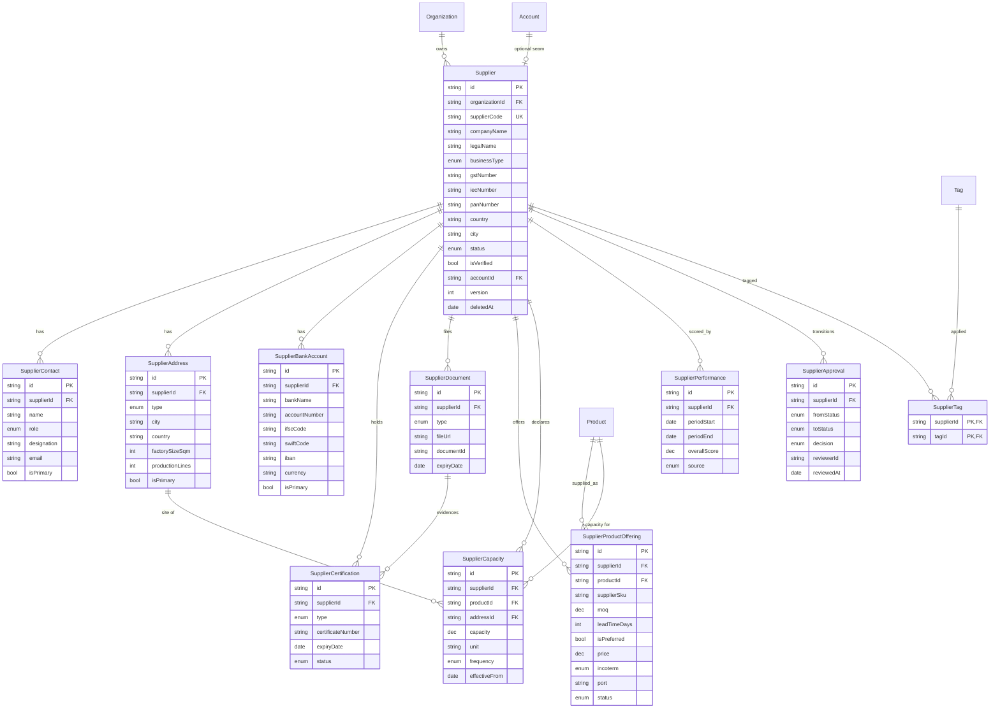

# Supplier Management - Sprint 3 Domain Model

Enterprise supplier master for the Triyara Business Network Platform. Vendor-master
domain, not a CRM and not a vendor list.

Design deliverable only: **no API, no UI, no migrations** are produced here.

Stack: Next.js · Prisma · PostgreSQL · TypeScript.

---

## 0. Name collisions and how they are resolved (read this first)

Three of the ten requested model names collide with things that already exist. Two are
hard blockers - Prisma refuses to compile a duplicate model or enum, exactly as it did for
`DocumentType` in Sprint 1.

| Requested          | Conflict                                                                                                         | Resolution                                                                       |
| ------------------ | ---------------------------------------------------------------------------------------------------------------- | -------------------------------------------------------------------------------- |
| `SupplierProduct`  | **Already exists and is FROZEN** (`TRY-BNP-SUPPLIER-01`) - `supplierProfileId`, `product` as a plain string      | Renamed **`SupplierProductOffering`**. The frozen table is untouched.            |
| `Supplier`         | Overlaps the frozen `Account` (legalName, country, relationshipStatus) + `SupplierProfile` (capabilities)        | New table as specified, plus a nullable `accountId` seam. See §4.1.              |
| `SupplierDocument` | No name clash, but the frozen `Document` module already stores supplier documents (`Document.supplierProfileId`) | Built as specified (metadata only), with a nullable `documentId` seam. See §4.7. |
| `Incoterm` enum    | **Already defined by the Product Catalog** (Incoterms 2020, 11 rules)                                            | **Reused, never redefined.** Redefining it would fail to compile.                |
| `Tag` model        | Already defined by the Product Catalog                                                                           | **Reused** via a new `SupplierTag` join. See §0.1.                               |

> **Verified, not assumed.** Compiling the schema with the requested name fails with
> `P1012: The model "SupplierProduct" cannot be defined because a model with that name
already exists`, and re-declaring `Incoterm` fails the same way. With the resolutions
> above the assembled schema passes `prisma validate` clean (42 models, 32 enums).

### 0.1 One model beyond the ten requested

The brief lists ten models but also requires **search by tags**. Nothing in the ten can
store a tag, so `SupplierTag` is added as an eleventh - a join onto the _existing_ catalog
`Tag`, not a new tag vocabulary. It is called out here rather than smuggled in.

### 0.2 Dependency on the Product Catalog branch

`SupplierProductOffering.productId` is a real foreign key to the catalog `Product`, and
`SupplierTag.tagId` to the catalog `Tag`. Both live on the unmerged
`feature/product-catalog-sprint1` branch, so **this module cannot migrate until that branch
merges**. This is the evolution the catalog ADR already anticipated ("Supplier:
`SupplierProduct(supplierId, productId, ...)` - new table, FK to Product").

---

## 1. Complete Prisma schema

```prisma
// ==========================================================================
// ENUMS
// ==========================================================================

/// What the supplier is, commercially. Drives sourcing strategy and the
/// documents that are mandatory at onboarding.
enum SupplierBusinessType {
  MANUFACTURER
  MANUFACTURER_EXPORTER
  MERCHANT_EXPORTER
  TRADER
  PROCESSOR
  FARMER_PRODUCER_ORGANISATION
  CONTRACT_MANUFACTURER
  OTHER
}

/// Onboarding + governance state. Mirrors the approval workflow; the current
/// value is denormalised here and every transition is recorded in
/// SupplierApproval.
enum SupplierStatus {
  DRAFT
  PENDING_REVIEW
  APPROVED
  REJECTED
  BLOCKED
  INACTIVE
}

/// Functional role of a contact, for routing. `designation` holds the person's
/// actual job title; this enum is what queries filter on.
enum SupplierContactRole {
  OWNER
  SALES
  EXPORT_MANAGER
  ACCOUNTS
  QUALITY
  LOGISTICS
  PRODUCTION
  OTHER
}

enum SupplierAddressType {
  REGISTERED_OFFICE
  FACTORY
  WAREHOUSE
  BRANCH
  DISPATCH_POINT
}

enum CertificationType {
  ISO
  FSSAI
  HACCP
  APEDA
  FDA
  BRCGS
  HALAL
  KOSHER
  ORGANIC
  GMP
  SPICE_BOARD
  OTHER
}

enum CertificationStatus {
  ACTIVE
  PENDING_RENEWAL
  EXPIRED
  SUSPENDED
  REVOKED
}

/// Supplier onboarding paperwork. Deliberately separate from the frozen
/// company-level `DocumentType` and the catalog's `ProductDocumentType`.
enum SupplierDocumentType {
  GST
  IEC
  PAN
  CANCELLED_CHEQUE
  MSME
  IMPORT_EXPORT_LICENSE
  FACTORY_LICENSE
  COMPANY_PROFILE
  CATALOG
  LAB_REPORT
  AGREEMENT
  OTHER
}

enum CapacityFrequency {
  PER_DAY
  PER_WEEK
  PER_MONTH
  PER_QUARTER
  PER_YEAR
  PER_SEASON
}

enum SupplierProductStatus {
  PENDING_APPROVAL
  ACTIVE
  INACTIVE
  DISCONTINUED
}

/// A single transition in the approval history.
enum ApprovalDecision {
  SUBMITTED
  APPROVED
  REJECTED
  BLOCKED
  UNBLOCKED
  REOPENED
}

/// How a scorecard was produced. Manual entries and computed ones must remain
/// distinguishable for audit.
enum PerformanceSource {
  MANUAL
  COMPUTED
  IMPORTED
}

// NOTE: `Incoterm` is NOT declared here. It is owned by the Product Catalog
// and reused as-is; redefining it would fail to compile.

// ==========================================================================
// SUPPLIER - the vendor master record
// ==========================================================================

model Supplier {
  id             String @id @default(cuid())
  organizationId String

  /// Human-facing key, e.g. "SUP-000142". Unique per tenant, never reused.
  supplierCode String
  companyName  String
  legalName    String
  businessType SupplierBusinessType

  email   String?
  phone   String?
  website String?

  /// Statutory identifiers. All optional: foreign suppliers have none of them.
  gstNumber String?
  iecNumber String?
  panNumber String?

  /// ISO 3166-1 alpha-2.
  country String? @db.Char(2)
  state   String?
  city    String?

  status     SupplierStatus @default(DRAFT)
  isVerified Boolean        @default(false)
  verifiedAt DateTime?

  /// Optional seam to the frozen Account aggregate, so a supplier that is also
  /// a known partner is not two disconnected records. Plain nullable link -
  /// the Account module is not modified. See §4.1.
  accountId String? @unique

  version     Int       @default(1)
  createdById String?
  updatedById String?
  deletedById String?
  createdAt   DateTime  @default(now())
  updatedAt   DateTime  @updatedAt
  deletedAt   DateTime?

  organization   Organization             @relation(fields: [organizationId], references: [id], onDelete: Cascade)
  contacts       SupplierContact[]
  addresses      SupplierAddress[]
  bankAccounts   SupplierBankAccount[]
  certifications SupplierCertification[]
  documents      SupplierDocument[]
  offerings      SupplierProductOffering[]
  capacities     SupplierCapacity[]
  performance    SupplierPerformance[]
  approvals      SupplierApproval[]
  tags           SupplierTag[]

  @@unique([organizationId, supplierCode])
  @@index([organizationId, status, deletedAt])
  @@index([organizationId, businessType])
  @@index([organizationId, isVerified, status])
  @@index([organizationId, country, state, city])
  @@index([organizationId, gstNumber])
  @@index([organizationId, iecNumber])
  @@index([organizationId, panNumber])
  @@index([organizationId, companyName])
  @@index([accountId])
}

// ==========================================================================
// PEOPLE, PLACES, MONEY
// ==========================================================================

model SupplierContact {
  id             String @id @default(cuid())
  supplierId     String
  organizationId String

  name        String
  role        SupplierContactRole @default(OTHER)
  /// The person's actual job title, e.g. "Sr. Manager - Exports".
  designation String?
  email       String?
  phone       String?
  whatsapp    String?

  isPrimary Boolean @default(false)
  sortOrder Int     @default(0)
  notes     String?

  version   Int       @default(1)
  createdAt DateTime  @default(now())
  updatedAt DateTime  @updatedAt
  deletedAt DateTime?

  supplier Supplier @relation(fields: [supplierId], references: [id], onDelete: Cascade)

  @@index([supplierId, isPrimary])
  @@index([supplierId, role])
  @@index([organizationId, email])
  @@index([supplierId, deletedAt])
}

/// Addresses, including factory sites. Factory-specific attributes live here
/// rather than in a separate model: a factory IS an address with extra data,
/// and the brief lists factories under addresses. See §4.3.
model SupplierAddress {
  id             String @id @default(cuid())
  supplierId     String
  organizationId String

  type  SupplierAddressType
  label String?

  line1      String
  line2      String?
  city       String
  state      String?
  postalCode String?
  /// ISO 3166-1 alpha-2.
  country    String  @db.Char(2)

  latitude  Decimal? @db.Decimal(9, 6)
  longitude Decimal? @db.Decimal(9, 6)

  /// Populated only when type = FACTORY. Null everywhere else.
  factorySizeSqm   Int?
  productionLines  Int?
  employeeCount    Int?
  establishedYear  Int?
  isOwnedPremises  Boolean?

  isPrimary Boolean @default(false)

  version   Int       @default(1)
  createdAt DateTime  @default(now())
  updatedAt DateTime  @updatedAt
  deletedAt DateTime?

  supplier   Supplier           @relation(fields: [supplierId], references: [id], onDelete: Cascade)
  capacities SupplierCapacity[]

  @@index([supplierId, type])
  @@index([organizationId, country, city])
  @@index([supplierId, deletedAt])
}

/// Settlement instructions. Account numbers are sensitive - see §4.6.
model SupplierBankAccount {
  id             String @id @default(cuid())
  supplierId     String
  organizationId String

  bankName          String
  branchName        String?
  accountHolderName String
  accountNumber     String
  ifscCode          String?
  swiftCode         String?
  iban              String?
  /// ISO 4217.
  currency          String  @db.Char(3)

  isPrimary  Boolean @default(false)
  isVerified Boolean @default(false)
  verifiedAt DateTime?

  version   Int       @default(1)
  createdAt DateTime  @default(now())
  updatedAt DateTime  @updatedAt
  deletedAt DateTime?

  supplier Supplier @relation(fields: [supplierId], references: [id], onDelete: Cascade)

  @@index([supplierId, isPrimary])
  @@index([supplierId, currency])
  @@index([supplierId, deletedAt])
}

// ==========================================================================
// COMPLIANCE
// ==========================================================================

model SupplierCertification {
  id             String @id @default(cuid())
  supplierId     String
  organizationId String

  type              CertificationType
  certificateNumber String
  issuedBy          String?
  issuedDate        DateTime?
  expiryDate        DateTime?
  status            CertificationStatus @default(ACTIVE)
  /// What the certificate actually covers, e.g. "Unit II - spice grinding".
  scope             String?

  /// Optional link to the uploaded certificate.
  supplierDocumentId String?

  version   Int       @default(1)
  createdAt DateTime  @default(now())
  updatedAt DateTime  @updatedAt
  deletedAt DateTime?

  supplier Supplier          @relation(fields: [supplierId], references: [id], onDelete: Cascade)
  document SupplierDocument? @relation(fields: [supplierDocumentId], references: [id], onDelete: SetNull)

  @@index([supplierId, type])
  @@index([supplierId, status])
  /// Drives the "expiring in 30 days" compliance sweep.
  @@index([organizationId, expiryDate])
  @@index([organizationId, type, status])
}

/// Onboarding paperwork. Metadata only, per the brief: the binary itself is
/// held by the storage provider, or by the frozen Document module when the
/// file needs access control and versioning. See §4.7.
model SupplierDocument {
  id             String @id @default(cuid())
  supplierId     String
  organizationId String

  type  SupplierDocumentType
  title String?

  fileUrl    String?
  storageKey String?
  mimeType   String?
  fileSize   Int?
  checksum   String?

  documentNumber String?
  issuedDate     DateTime?
  expiryDate     DateTime?

  /// Seam to the FROZEN Document module. Populated when this file is also a
  /// managed, access-controlled, versioned platform document.
  documentId String?

  version   Int       @default(1)
  createdAt DateTime  @default(now())
  updatedAt DateTime  @updatedAt
  deletedAt DateTime?

  supplier       Supplier                @relation(fields: [supplierId], references: [id], onDelete: Cascade)
  certifications SupplierCertification[]

  @@index([supplierId, type])
  @@index([organizationId, expiryDate])
  @@index([documentId])
  @@index([supplierId, deletedAt])
}

// ==========================================================================
// COMMERCIAL: what this supplier can actually supply
// ==========================================================================

/// Named SupplierProductOffering because SupplierProduct is a FROZEN model.
/// This is the join between the vendor master and the Product Catalog.
model SupplierProductOffering {
  id             String @id @default(cuid())
  supplierId     String
  organizationId String
  productId      String

  /// The supplier's own part number for this product.
  supplierSku String?

  moq          Decimal? @db.Decimal(18, 4)
  moqUnit      String?
  leadTimeDays Int?
  isPreferred  Boolean  @default(false)

  /// Indicative supplier price. Binding prices belong to the Quotation module -
  /// see §4.5.
  price    Decimal?  @db.Decimal(18, 4)
  currency String?   @db.Char(3)
  incoterm Incoterm?
  port     String?

  validFrom DateTime?
  validTo   DateTime?

  status SupplierProductStatus @default(PENDING_APPROVAL)
  notes  String?

  version   Int       @default(1)
  createdAt DateTime  @default(now())
  updatedAt DateTime  @updatedAt
  deletedAt DateTime?

  supplier Supplier @relation(fields: [supplierId], references: [id], onDelete: Cascade)
  product  Product  @relation(fields: [productId], references: [id], onDelete: Restrict)

  /// A supplier may quote the same product on several terms, but not twice on
  /// identical terms.
  @@unique([supplierId, productId, incoterm, port, currency])
  /// The sourcing question: "who can supply product X?"
  @@index([organizationId, productId, status])
  @@index([supplierId, status])
  @@index([productId, isPreferred])
  @@index([supplierId, deletedAt])
}

/// Production capability. Plant-wide when productId is null; product-specific
/// when set. Site-specific when addressId points at a FACTORY address.
model SupplierCapacity {
  id             String @id @default(cuid())
  supplierId     String
  organizationId String

  /// Null = capacity across the whole catalogue.
  productId String?
  /// Null = across all sites; set = one factory.
  addressId String?

  capacity  Decimal           @db.Decimal(18, 4)
  /// UoM the capacity is expressed in, e.g. "MT", "KG", "CBM".
  unit      String
  frequency CapacityFrequency

  effectiveFrom DateTime
  effectiveTo   DateTime?
  notes         String?

  version   Int       @default(1)
  createdAt DateTime  @default(now())
  updatedAt DateTime  @updatedAt
  deletedAt DateTime?

  supplier Supplier         @relation(fields: [supplierId], references: [id], onDelete: Cascade)
  product  Product?         @relation(fields: [productId], references: [id], onDelete: SetNull)
  address  SupplierAddress? @relation(fields: [addressId], references: [id], onDelete: SetNull)

  @@index([supplierId, effectiveFrom, effectiveTo])
  @@index([organizationId, productId])
  @@index([addressId])
  @@index([supplierId, deletedAt])
}

// ==========================================================================
// GOVERNANCE: performance and approval
// ==========================================================================

/// One scorecard per supplier per period. Scores are 0-100.
model SupplierPerformance {
  id             String @id @default(cuid())
  supplierId     String
  organizationId String

  periodStart DateTime
  periodEnd   DateTime

  deliveryScore       Decimal? @db.Decimal(5, 2)
  qualityScore        Decimal? @db.Decimal(5, 2)
  communicationScore  Decimal? @db.Decimal(5, 2)
  documentationScore  Decimal? @db.Decimal(5, 2)
  responsivenessScore Decimal? @db.Decimal(5, 2)
  /// Stored, not derived on read - the weighting will change and historical
  /// scorecards must stay reproducible. See §4.4.
  overallScore        Decimal? @db.Decimal(5, 2)

  ordersCount        Int?
  onTimeDeliveryRate Decimal? @db.Decimal(5, 2)
  rejectionRate      Decimal? @db.Decimal(5, 2)

  source       PerformanceSource @default(MANUAL)
  computedAt   DateTime?
  reviewedById String?
  notes        String?

  version   Int       @default(1)
  createdAt DateTime  @default(now())
  updatedAt DateTime  @updatedAt
  deletedAt DateTime?

  supplier Supplier @relation(fields: [supplierId], references: [id], onDelete: Cascade)

  @@unique([supplierId, periodStart, periodEnd])
  @@index([organizationId, periodEnd])
  @@index([organizationId, overallScore])
  @@index([supplierId, periodEnd])
}

/// Append-only approval history. One row per transition; never updated, never
/// soft-deleted. The supplier's current state is denormalised on
/// Supplier.status. See §4.2.
model SupplierApproval {
  id             String @id @default(cuid())
  supplierId     String
  organizationId String

  fromStatus SupplierStatus?
  toStatus   SupplierStatus
  decision   ApprovalDecision

  reviewerId String
  comments   String?
  reviewedAt DateTime @default(now())
  createdAt  DateTime @default(now())

  supplier Supplier @relation(fields: [supplierId], references: [id], onDelete: Cascade)

  @@index([supplierId, reviewedAt])
  @@index([organizationId, toStatus])
  @@index([organizationId, reviewerId])
}

/// Supplier <-> catalog Tag. Reuses the existing Tag vocabulary rather than
/// introducing a second one.
model SupplierTag {
  supplierId String
  tagId      String

  createdAt DateTime @default(now())

  supplier Supplier @relation(fields: [supplierId], references: [id], onDelete: Cascade)
  tag      Tag      @relation(fields: [tagId], references: [id], onDelete: Cascade)

  @@id([supplierId, tagId])
  @@index([tagId])
}
```

### Back-relations required elsewhere (column-less, no table changes)

```prisma
model Organization { suppliers Supplier[] }          // + existing fields
model Product      { supplierOfferings SupplierProductOffering[]
                     supplierCapacities SupplierCapacity[] }
model Tag          { suppliers SupplierTag[] }
```

`Organization` is frozen; this is the ORM-only back-relation pattern approved in ADR-0007,
which adds no column. `Product` and `Tag` belong to the catalog, which is additive here.

### Constraints for the migration phase (Prisma cannot express these)

Listed, not generated - migrations are explicitly out of scope:

1. **One primary per collection** - partial unique indexes on
   `SupplierContact(supplierId) WHERE isPrimary AND deletedAt IS NULL`, and the same for
   `SupplierAddress` and `SupplierBankAccount`.
2. **Statutory identifiers unique per tenant when present** - partial unique on
   `Supplier(organizationId, gstNumber) WHERE gstNumber IS NOT NULL AND deletedAt IS NULL`;
   likewise `iecNumber`, `panNumber`. A plain `@@unique` would collapse every NULL row.
3. **No overlapping capacity windows** for the same supplier/product/site -
   `EXCLUDE USING gist` over `tsrange(effectiveFrom, effectiveTo)`, requires `btree_gist`.
   Same pattern the catalog uses for `ProductPrice`.
4. **Score bounds** - `CHECK` constraints keeping every `*Score` within `0..100` and every
   rate within `0..100`.
5. **Full-text search** - GIN expression index over
   `to_tsvector('english'::regconfig, companyName || legalName || supplierCode)`, plus
   `pg_trgm` on `companyName` and `supplierCode`. The `'english'::regconfig` cast is
   mandatory; without it the single-argument overload is only STABLE and Postgres rejects
   the index with `42P17`.
6. **Period sanity** - `CHECK (periodEnd > periodStart)` on `SupplierPerformance`, and
   `CHECK (effectiveTo IS NULL OR effectiveTo > effectiveFrom)` on `SupplierCapacity`.

---

## 2. Enterprise relationships

| From               | To                        | Card. | On delete    | Rationale                                                                   |
| ------------------ | ------------------------- | ----- | ------------ | --------------------------------------------------------------------------- |
| `Organization`     | `Supplier`                | 1 : N | **Cascade**  | Tenant offboarding removes tenant data.                                     |
| `Supplier`         | `SupplierContact`         | 1 : N | **Cascade**  | Owned by the supplier; meaningless without it.                              |
| `Supplier`         | `SupplierAddress`         | 1 : N | **Cascade**  | Owned.                                                                      |
| `Supplier`         | `SupplierBankAccount`     | 1 : N | **Cascade**  | Owned.                                                                      |
| `Supplier`         | `SupplierCertification`   | 1 : N | **Cascade**  | Owned.                                                                      |
| `Supplier`         | `SupplierDocument`        | 1 : N | **Cascade**  | Owned.                                                                      |
| `Supplier`         | `SupplierProductOffering` | 1 : N | **Cascade**  | Owned.                                                                      |
| `Supplier`         | `SupplierCapacity`        | 1 : N | **Cascade**  | Owned.                                                                      |
| `Supplier`         | `SupplierPerformance`     | 1 : N | **Cascade**  | Owned.                                                                      |
| `Supplier`         | `SupplierApproval`        | 1 : N | **Cascade**  | Owned; append-only within that lifetime.                                    |
| `Product`          | `SupplierProductOffering` | 1 : N | **Restrict** | A product being supplied cannot be hard-deleted out from under sourcing.    |
| `Product`          | `SupplierCapacity`        | 1 : N | **SetNull**  | Losing the product downgrades the row to plant-wide capacity, not deletion. |
| `SupplierAddress`  | `SupplierCapacity`        | 1 : N | **SetNull**  | Closing a site leaves the historical capacity record intact.                |
| `SupplierDocument` | `SupplierCertification`   | 1 : N | **SetNull**  | Removing the scan must not delete the compliance fact.                      |
| `Supplier` ↔ `Tag` | via `SupplierTag`         | M : N | **Cascade**  | Join rows carry no independent meaning.                                     |
| `Supplier`         | `Account` (frozen)        | 0..1  | _(no FK)_    | Nullable plain link; the Account module is not constrained. See §4.1.       |

**The ownership rule, unchanged from the catalog:** things _owned by_ the aggregate root
cascade; _shared master data_ restricts; things that are merely _referenced context_
(site, product on a capacity row, scanned document) null out so the historical fact
survives.

---

## 3. ER diagram



---

## 4. Architecture decisions

### 4.1 `Supplier` is a vendor master, not a second `Account`

The brief specifies a standalone `Supplier` with its own company identity. The platform
already has `Account` (the partner record) and its frozen 1:1 `SupplierProfile`
(capabilities). Building `Supplier` as specified therefore creates a genuine overlap.

It is built as specified, because the procurement domain legitimately needs a vendor master
that is independent of CRM state - this is the same split SAP makes between the business
partner and the vendor master. To stop the two drifting into unreconciled duplicates,
`Supplier.accountId` is a **nullable, unique, plain link**: no foreign key, so the frozen
`Account` table gains no constraint, but a supplier that is also a known partner is
traceable to it.

> **This is the decision most worth challenging at review.** The alternative - making
> `Supplier` a 1:1 extension of `Account`, exactly as `SupplierProfile` is - would avoid the
> duplicate company identity entirely, at the cost of not matching the requested field list
> and forcing every supplier to first exist as an Account. The model is otherwise
> unchanged either way; only `Supplier`'s identity columns move.

### 4.2 Approval is an append-only history plus a denormalised current state

`SupplierApproval` has no `updatedAt`, no `deletedAt` and no `version`: a governance record
that can be edited is not a governance record. Every transition is one immutable row
carrying `fromStatus`, `toStatus`, decision, reviewer and comments.

`Supplier.status` denormalises the current value so the common query - "show me pending
suppliers" - is one indexed read rather than a per-row lateral join into the latest
approval. The service writes both in one transaction.

### 4.3 Factory data lives on the address, not in its own model

A factory _is_ an address with extra attributes: size, lines, headcount, year, ownership.
Splitting it into `SupplierFactory` would duplicate the whole address block and force a
join for every site listing. The cost is a handful of columns that are null unless
`type = FACTORY`, which is the conventional trade (SAP attaches plant data to the address
the same way). `SupplierCapacity.addressId` then points at a specific factory, giving
per-site capacity for free.

### 4.4 `overallScore` is stored, not computed on read

Deriving the overall score at read time means last year's scorecards silently change the
moment the weighting is retuned. Supplier ratings drive commercial decisions and must be
reproducible, so the composite is computed once and stored, with `source` and `computedAt`
recording how and when. `MANUAL` and `COMPUTED` scorecards stay distinguishable for audit.

### 4.5 Offering price is indicative; binding price belongs to Quotation

`SupplierProductOffering.price` is a reference rate for sourcing shortlists. A binding
commercial commitment - validity, tiers, negotiated terms - is a quotation, and lives in
that module. The unique key `(supplierId, productId, incoterm, port, currency)` lets one
supplier list FOB Nhava Sheva and CIF Rotterdam for the same product without pretending
either is a contract.

This is the mirror of the catalog rule that catalog price ≠ supplier price: `Product`
describes _what the good is_, `ProductPrice` is Triyara's own list price, and
`SupplierProductOffering` is _what this supplier will do it for_.

### 4.6 Bank details are sensitive data with a deliberate storage decision

`accountNumber`, `iban` and `swiftCode` are payment credentials. They are stored as plain
columns in this model, which is acceptable **only** with the following, and the service
layer must implement them:

- application-level encryption at rest for `accountNumber` and `iban`, or a
  column-encryption extension;
- masked reads by default (last four digits), with full reveal behind an explicit,
  audited permission;
- audit rows on every read of the full value, not just on writes;
- exclusion from list projections and from any export or search index.

No index is defined on `accountNumber` precisely so it cannot become a lookup key.

### 4.7 `SupplierDocument` is metadata, with a seam to the frozen Document module

The brief says "store metadata only", and the frozen `Document` module already handles
access-controlled, versioned binaries and even carries a `supplierProfileId`. Rather than
duplicating that machinery or modifying it, `SupplierDocument` holds onboarding metadata
and a nullable `documentId`. Lightweight paperwork stays lightweight; anything needing
version history and access control is also registered as a platform `Document` and linked.

### 4.8 Statutory identifiers are optional and uniquely constrained only when present

GST, IEC and PAN are India-specific; a supplier in Vietnam has none. They are nullable,
and uniqueness is enforced by **partial** unique indexes so that dozens of foreign
suppliers with NULL GST do not collide - a plain `@@unique` would treat them as duplicates
under some engines and, worse, invites the assumption that every supplier has one.

### 4.9 Soft delete, versioning and org isolation everywhere except the audit trail

Every mutable table carries `deletedAt` and an integer `version` feeding the platform's
existing ETag / If-Match → 412 path, and every query is tenant-filtered. `SupplierApproval`
is the deliberate exception on both counts (§4.2).

---

## 5. Performance strategy

1. **Tenant-leading composite indexes.** Every hot index starts with `organizationId`, so
   index locality follows tenant locality and one large tenant cannot degrade others.
2. **The sourcing query is the one to optimise.** "Who can supply product X, approved,
   ranked by preference and score" is the module's highest-frequency read. It is served by
   `SupplierProductOffering(organizationId, productId, status)` plus
   `(productId, isPreferred)`, with the supplier's current status already denormalised on
   `Supplier.status` so no approval-history join is needed.
3. **Narrow list projection vs wide detail.** A supplier list needs code, name, type,
   country, status, score - never the address, bank or document collections. Two explicit
   `select` shapes, as the catalog does.
4. **Latest-scorecard access is indexed, not scanned.** `(supplierId, periodEnd)` makes
   "current rating" a top-1 index read rather than an aggregate over history.
5. **Compliance sweeps are indexed.** `(organizationId, expiryDate)` on both certifications
   and documents turns "expiring within 30 days" into a range scan.
6. **Search is expression-indexed, not `LIKE '%…%'`.** Full-text over company/legal/code,
   `pg_trgm` for fuzzy code and name matching, and dedicated indexes on GST/IEC/PAN for
   exact statutory lookup.
7. **N+1 is the real risk, as always.** A supplier list showing primary contact, primary
   address and latest score must not lazily load three collections per row; the partial
   unique "one primary" indexes make each primary a single indexed lookup.
8. **Cursor pagination only**, reusing the platform's existing keyset helper.
9. **Partial indexes on `deletedAt IS NULL`** keep the working set proportional to live
   suppliers rather than to every supplier ever onboarded.

---

## 6. Scalability strategy

- **Child collections are unbounded but always parent-filtered.** Contacts, addresses,
  documents, offerings, capacities and scorecards are only ever read via `supplierId`,
  the leading index column, so growth is absorbed by the index rather than by scans.
- **Performance history is the only table that grows without bound per supplier.** It is
  append-mostly and time-keyed, making it the natural first candidate for range
  partitioning on `periodEnd`, or for archival beyond a retention window, with no model
  change.
- **The approval log is append-only**, so it never suffers write contention from updates
  and can be moved to cheaper storage on the same key.
- **Read/write asymmetry.** Supplier data is read far more than written and no read path
  depends on a write-side lock, so a read replica or a cached sourcing projection drops in
  later without schema change.
- **Search grows outward, not inward.** `Supplier` is a single well-defined aggregate, so
  it projects cleanly into an external index (OpenSearch/Typesense) if catalogue-scale
  faceted search is needed - no schema change required to adopt one.
- **Multi-region and multi-entity** are already expressible: `organizationId` scopes the
  tenant, and addresses carry country/geo, so regional sharding or per-country routing is
  a deployment decision rather than a modelling one.

---

## 7. Forward compatibility - no redesign required

`Supplier` is master data. Every downstream module points _at_ it and never modifies it;
`Supplier.id` is the stable key and `supplierCode` the stable human identifier.

| Module              | How it attaches                                                                                                     | Why it is additive                                                                                                                                                 |
| ------------------- | ------------------------------------------------------------------------------------------------------------------- | ------------------------------------------------------------------------------------------------------------------------------------------------------------------ |
| **RFQ**             | `RfqInvitation(rfqId, supplierId, invitedAt, respondedAt)` - FK inward.                                             | The shortlist is built from `SupplierProductOffering` + `SupplierCapacity`, both already queryable by product.                                                     |
| **Quotation**       | `Quotation(supplierId, rfqId, validUntil)` + `QuotationLine(productId, price, incoterm, port, snapshotJson)`.       | Offering price is explicitly indicative (§4.5), so quotations add binding terms without contradicting the master.                                                  |
| **Purchase Orders** | `PurchaseOrder(supplierId, bankAccountId, addressId, ...)` with denormalised supplier name/GST at issue time.       | POs are legal records: they copy identifiers rather than join live ones, so later master edits cannot mutate history. Soft delete guarantees the FK never dangles. |
| **Shipment**        | `Shipment(purchaseOrderId, dispatchAddressId, port, incoterm)`.                                                     | Dispatch points are already modelled as addresses; `Incoterm` is the one shared enum, so no vocabulary is invented.                                                |
| **Inventory**       | `StockItem(productId, warehouseId, lotNumber, supplierId?)` for traceability to origin.                             | `Supplier` holds no stock fields - stock is location-scoped and the master stays location-agnostic.                                                                |
| **Quality Control** | `QcInspection(supplierId, purchaseOrderId, productId, result, defects)` feeding `SupplierPerformance.qualityScore`. | Performance is already a periodic scorecard with a `COMPUTED` source, so QC results flow in as a computation input rather than a new concept.                      |

Four properties make all six additive:

- **The master owns no transactional state** - no stock, no orders, no invoices.
- **Identifiers are permanent.** Soft delete plus never-reused `supplierCode` means no
  future foreign key can dangle.
- **Shared vocabularies are reused, not re-declared** - `Incoterm`, `Tag` and `Product` all
  come from the catalog.
- **Extension over modification** - every downstream module adds its own tables with keys
  pointing inward, exactly as this module does to the frozen ones.

---

## 8. Deliberately out of scope

No API routes, no UI, no migration files and no seed data are produced by this document,
per the Sprint 3 brief. The frozen modules (Authentication, Accounts, SupplierProfile,
BuyerProfile, Documents, Verification, Activity, Notifications) are unmodified, and the
Product Catalog is referenced but not redesigned.
